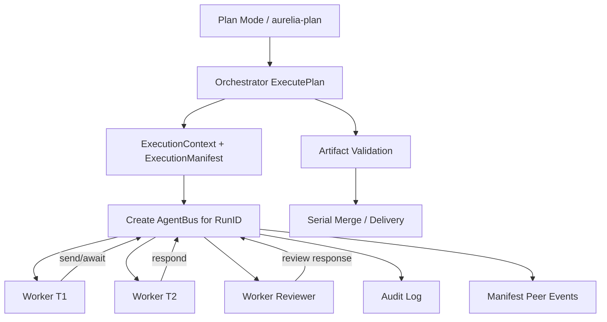

# Agent Comms — Design

**Spec:** `.specs/features/agent-comms/spec.md`  
**Status:** Draft

---

## Architecture Overview

Agent Comms adiciona um canal local, escopado por execução, para comunicação controlada entre workers PI. O Orchestrator continua sendo o coordenador principal. O bus apenas permite colaboração pontual entre tasks autorizadas.



Core rules:

1. Agent Bus é **local ao daemon Go** no MVP.
2. Agent Bus é criado por `RunID` e fechado no fim/cancelamento da execução.
3. Peers são deny-by-default e precisam estar declarados no plano/tarefa.
4. Mensagens são texto curto, não canal de arquivo/diff gigante.
5. Toda mensagem gera manifest event e audit log.
6. Peer review nunca substitui validation final baseada em artefatos.

---

## Component Changes

### 1. Plan schema: peers explícitos

**Location:** `internal/orchestrator/plan.go`

Adicionar campo opcional em `Task`:

```go
type Task struct {
    ID          string   `json:"id"`
    Description string   `json:"description"`
    Prompt      string   `json:"prompt"`
    Agent       string   `json:"agent,omitempty"`
    DependsOn   []string `json:"depends_on,omitempty"`
    Verify      string   `json:"verify,omitempty"`
    Peers       []string `json:"peers,omitempty"`
    CapabilityProfile string `json:"capability_profile,omitempty"`
}
```

Sem `Peers`, a task não pode enviar mensagens.

`BuildExecutionPrompt` e Plan Mode devem documentar que `peers` é opt-in e deve usar `task_id`, não nome de agent. `capability_profile` vem da spec de guard-rails e controla tools da task; Agent Comms não aumenta permissões de filesystem/shell.

### 2. New package `internal/agentcomms/`

**Files:**

- `bus.go` — interface principal e implementação em memória
- `message.go` — tipos de mensagem, status e erro
- `limits.go` — configuração de budget/timeout
- `policy.go` — integração com security policy/redaction básica
- `manifest.go` — adapter para registrar eventos no manifest

Tipos propostos:

```go
type Bus struct {
    runID   string
    limits  Limits
    policy  Policy
    store   MessageStore
    clock   Clock
}

type Limits struct {
    MaxPeerMessagesPerRun  int
    MaxPeerMessagesPerTask int
    MaxPeerHops            int
    MaxPeerMessageBytes    int
    AwaitTimeout           time.Duration
}

type Message struct {
    ID         string
    RunID      string
    FromTaskID string
    ToTaskID   string
    ParentID   string
    Hop         int
    Body       string
    Status     MessageStatus
    CreatedAt  time.Time
    RespondedAt *time.Time
}

type MessageStatus string

const (
    MessagePending   MessageStatus = "pending"
    MessageResponded MessageStatus = "responded"
    MessageRejected  MessageStatus = "rejected"
    MessageTimedOut  MessageStatus = "timed_out"
)
```

MVP pode ser in-memory porque o bus vive só durante a execução. Persistência em SQLite fica para depois se houver resume de execução.

### 3. Interface usada pelo Orchestrator

**Location:** `internal/orchestrator/orchestrator.go` ou novo arquivo `peer_comms.go`

```go
type PeerMessenger interface {
    ListPeers(taskID string) ([]Peer, error)
    Send(ctx context.Context, fromTaskID, toTaskID, body string) (*PeerMessageReceipt, error)
    Await(ctx context.Context, messageID string) (*PeerResponse, error)
    Respond(ctx context.Context, messageID, fromTaskID, body string) error
}
```

O Orchestrator injeta uma implementação por run. Quando Agent Comms está desabilitado, usa `NoopPeerMessenger` que retorna erro claro.

### 4. Como o worker acessa as primitivas

Há duas opções para o contrato com PI:

#### Opção A — Tool bridge dedicada no futuro

Expor ferramentas para o PI, como:

- `agent_list_peers`
- `agent_send_message`
- `agent_await_response`
- `agent_respond`

**Prós:** UX natural para o worker.  
**Contras:** depende de como o PI SDK permite custom tools/extensions por request.

#### Opção B — Prompt protocol no MVP

O worker recebe no system prompt uma seção dizendo que pode solicitar peer comms emitindo blocos estruturados, por exemplo:

````text
```aurelia-peer-message
{"to":"T2","body":"Quais casos de teste devo cobrir para esta API?","await":true}
```
````

O event loop detecta o bloco, chama o bus, injeta a resposta no próximo turno/retry ou no feedback do worker.

**Prós:** não depende de custom tool imediata.  
**Contras:** menos ergonômico e exige parsing robusto.

**Recomendação MVP:** começar com Opção B se custom tools não estiverem prontas no bridge; evoluir para Opção A depois.

### 5. Integração com `ExecutePlan`

**Location:** `internal/orchestrator/execute.go`

Mudanças:

1. Antes de executar waves, construir permissões de peers a partir do plano.
2. Criar `AgentBus` para o `ExecutionContext.RunID`.
3. Passar `PeerMessenger` para prompt builder/worker execution.
4. Ao finalizar/cancelar execução, fechar bus.
5. Registrar peer events no `ExecutionManifest`.

Importante: Agent Comms não altera dependências de wave. Se T2 depende de T1, isso continua controlado por `DependsOn`. Peers são apenas comunicação, não ordem de execução.

### 6. Manifest events

**Location:** `internal/orchestrator/manifest.go`

Adicionar eventos internos:

```go
type ManifestEvent struct {
    Type      string
    RunID     string
    TaskID    string
    PeerTaskID string
    MessageID string
    Status    string
    Detail    string
    CreatedAt time.Time
}
```

Para evitar vazar conteúdo sensível, o manifest deve armazenar:

- message id
- from/to
- status
- tamanho
- hash curto do body
- body redigido/truncado somente se policy permitir

### 7. Payload policy and SecurityPolicy integration

Agent Comms usa uma policy de payload simples no MVP. Ela complementa, mas não substitui, `CapabilityProfile`/tool policy da spec de guard-rails:

- rejeitar payload acima do limite;
- rejeitar padrões óbvios de segredo: `api_key=`, `token=`, `password=`, `secret=`, bearer tokens, chaves high-entropy;
- rejeitar se mensagem tentar pedir leitura de paths sensíveis (`~/.ssh`, `~/.aurelia/config`, `.env`, keychain);
- auditar sem ecoar payload completo.

Essa policy deve se integrar com `SecurityPolicy` de `security-guard-rails`, mas o escopo aqui é mensagem entre agentes, não execução de tools.

### 8. Telegram UX

Não enviar cada mensagem interna ao Telegram.

Mostrar apenas progresso agregado, por exemplo:

```text
🤝 Workers consultando peers internos: backend → tests
```

No resumo final/consolidation, mencionar:

```text
Colaboração interna: 3 mensagens entre backend, tests e security-review.
```

Detalhes completos ficam em logs/manifest.

---

## Data Contracts

### Plan JSON

```json
{
  "feature": "example-feature",
  "tasks": [
    {
      "id": "T1",
      "description": "Implement API",
      "agent": "backend",
      "peers": ["T2", "T3"],
      "prompt": "..."
    },
    {
      "id": "T2",
      "description": "Write tests",
      "agent": "tests",
      "prompt": "..."
    },
    {
      "id": "T3",
      "description": "Security review",
      "agent": "security",
      "prompt": "..."
    }
  ]
}
```

### Peer message block, if using prompt protocol

````text
```aurelia-peer-message
{
  "to": "T2",
  "body": "Quais casos de teste devo cobrir para esta mudança?",
  "await": true
}
```
````

### Peer response block

````text
```aurelia-peer-response
{
  "message_id": "pm_123",
  "body": "Cubra sucesso, payload inválido, permissão negada e regressão de contrato."
}
```
````

---

## Risks

- **Loops:** mitigado por max messages/hops/timeouts.
- **Custo:** budget por run/task e payload curto.
- **Vazamento de dados:** deny-by-default para peers, payload policy, redaction e audit.
- **Complexidade no executor:** manter MVP restrito a run local e peers explícitos.
- **Falsa sensação de validação:** peer review é auxiliar; validation final continua mandatória.

---

## Validation Gates

- `go build ./...`
- `go vet ./...`
- `go test ./... -short`
- `go test ./... -v`
