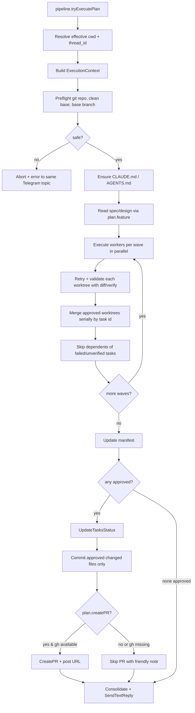

# Agent Orchestration — Execution Mode — Design

**Spec:** `.specs/features/agent-orchestration-execution/spec.md`
**Status:** Draft (gap-closing iteration on already-shipped code)

---

## Current State Snapshot

The pipeline already wires Telegram → pipeline service → bridge → orchestrator. The flow today:

```
internal/telegram/input.go
   └─ internal/pipeline/service.go::Run
        └─ ResilientBridge.Execute (PI SDK call via bundled TS)
             └─ pipeline.pipeline.go: event loop
                  ├─ "result" event with text
                  └─ tryExecutePlan() — orchestrator.ExtractPlan
                       └─ BotController.executeApprovedPlan (internal/telegram/orchestration.go)
                            ├─ EnsureClaudeMd / EnsureAgentsMd
                            ├─ ReadFileContent CLAUDE.md / AGENTS.md
                            ├─ findFeatureDoc spec.md / design.md   ← BROKEN: last-alphabetical
                            ├─ repoRoot from daemon cwd              ← BROKEN: ignores chat /cwd
                            ├─ Orchestrator.ExecutePlan
                            │     └─ per wave, per task:
                            │          ├─ ResolveAgentConfig
                            │          ├─ WorktreeManager.Create (uses currentBranch="HEAD" ← BROKEN)
                            │          ├─ systemPromptBuilder → BuildWorkerPrompt ← DUPLICATES task
                            │          ├─ ExecuteTask (Bridge.Execute, stream events)
                            │          └─ on success: Merge + Cleanup ← BROKEN: can merge concurrently
                            ├─ Validate worker prose only (once, no retry ← BROKEN)
                            ├─ BuildConsolidationPrompt + Consolidate
                            ├─ SendTextReply
                            └─ [stop] ← BROKEN: no UpdateTasksStatus / CommitChanges / CreatePR
```

The components that are already implemented and tested:

| Component | File | Status |
|---|---|---|
| `Plan`, `Task`, `TaskResult`, `WorkerEvent`, `WorkerConfig` | `internal/orchestrator/plan.go` | OK |
| `Plan.ExecutionOrder` (topological wave sort) | `internal/orchestrator/plan.go` | OK |
| `WorktreeManager.Create/Merge/Cleanup/CleanupAll` | `internal/orchestrator/worktree.go` | OK, `CleanupAll` unused |
| `ResolveAgentConfig`, `DefaultWorkerConfig` | `internal/orchestrator/defaults.go` | OK |
| `Orchestrator` struct + `BridgeExecutor` interface | `internal/orchestrator/orchestrator.go` | OK |
| `ExtractPlan`, `StripPlanBlock` | `internal/orchestrator/extract.go` | OK |
| `ExecutePlan`, `ExecuteTask` | `internal/orchestrator/execute.go` | OK except `currentBranch` stub |
| `Validate`, `parseValidationResponse` | `internal/orchestrator/validate.go` | OK (single-shot) |
| `BuildOrchestratorPrompt`, `BuildExecutionPrompt`, `BuildWorkerPrompt`, `BuildValidationPrompt`, `BuildConsolidationPrompt` | `internal/orchestrator/prompt.go` | OK except task duplication |
| `EnsureClaudeMd`, `EnsureAgentsMd` | `internal/orchestrator/agents_md.go` | OK |
| `UpdateTasksStatus` | `internal/orchestrator/tasks_status.go` | OK but unused |
| `CommitChanges`, `CreatePR`, `IsGHAvailable` | `internal/orchestrator/git.go` | OK but unused |
| `WorkerStatusReporter` | `internal/telegram/worker_status.go` | OK |
| `executeApprovedPlan` | `internal/telegram/orchestration.go` | Partial — see gaps |

This design covers the **delta** needed to close the gaps. Components above keep their interfaces unless explicitly noted.

---

## Architecture Overview



`Orchestrator` startup: on construction call `WorktreeManager.CleanupAll()` once (best-effort, log count).

Execution is split into four responsibilities:

1. **Pipeline/Telegram context** resolves where this run belongs: chat, thread, original message, effective cwd.
2. **Orchestrator preflight** proves the repo is safe before a worker touches anything.
3. **Worker execution** can remain parallel, but validation uses real artifacts and merge is serialized per wave.
4. **Delivery** updates tasks, commits only approved files, optionally opens a PR, and posts every user-facing message back to the originating topic.

---

## Component Changes

### 0. `ExecutionContext` and handoff signature

**Why:** The current handoff loses `threadID` and uses `OrchestratorConfig.RepoRoot`, which is created from the daemon cwd. Execution must use the chat/thread's effective `/cwd`.

**Locations:** `internal/pipeline/service.go`, `internal/pipeline/pipeline.go`, `internal/telegram/pipeline.go`, `internal/telegram/orchestration.go`, `internal/orchestrator/orchestrator.go`

```go
type ExecutionContext struct {
    RunID      string
    RepoRoot   string
    BaseBranch string
    ChatID     int64
    ThreadID   int
    MessageID  int
    Feature    string
    CreatePR   bool
    StartedAt  time.Time
}
```

Pipeline output changes from:

```go
ExecuteApprovedPlan(chatID int64, messageID int, plan *orchestrator.Plan)
```

to:

```go
ExecuteApprovedPlan(chatID int64, threadID int, messageID int, cwd string, plan *orchestrator.Plan)
```

`pipeline.tryExecutePlan` resolves `cwd := s.effectiveCwd(agent, chatID, threadID)` before handing off. Empty cwd aborts with a message telling the user to set `/cwd`.

### 0b. `PreflightExecution`

**Location:** `internal/orchestrator/preflight.go` (new)

```go
type PreflightResult struct {
    BaseBranch string
    DirtyPaths []string
    GHAvailable bool
}

func (o *Orchestrator) PreflightExecution(ctx context.Context, repoRoot string, createPR bool) (*PreflightResult, error)
```

Checks:

- `repoRoot/.git` or `git -C repoRoot rev-parse --show-toplevel` succeeds
- `ResolveBaseBranch` succeeds and is not detached
- `git status --porcelain` is empty before workers start
- if `createPR` is true, `IsGHAvailable()` is checked upfront and recorded; it does not block execution

Dirty repo is fatal before workers. This is stricter than normal chat behavior because orchestration will merge and commit autonomously.

### 0c. `ExecutionManifest`

**Location:** `internal/orchestrator/manifest.go` (new)

```go
type TaskStatus string

const (
    TaskPending    TaskStatus = "pending"
    TaskRunning    TaskStatus = "running"
    TaskApproved   TaskStatus = "approved"
    TaskFailed     TaskStatus = "failed"
    TaskSkipped    TaskStatus = "skipped"
    TaskUnverified TaskStatus = "unverified"
    TaskEscalated  TaskStatus = "escalated"
)

type ExecutionManifest struct {
    RunID      string
    RepoRoot   string
    BaseBranch string
    Feature    string
    StartedAt  time.Time
    FinishedAt time.Time
    Tasks      map[string]*TaskRecord
}

type TaskRecord struct {
    TaskID       string
    Status       TaskStatus
    Attempts     int
    ChangedFiles []string
    Verify       *VerifyResult
    CostUSD      float64
    DurationMs   int64
    Error        string
}
```

For this spec the manifest can remain in-memory. It gives the consolidation prompt and PR body a single source of truth and creates a clean future path for persistence/resume.

### 1. `WorktreeManager.ResolveBaseBranch` (new)

**Location:** `internal/orchestrator/worktree.go`

**Why:** Replace the `currentBranch()` stub in `execute.go` which returns `"HEAD"`.

**Signature:**

```go
// ResolveBaseBranch returns the current branch name (e.g., "main"), or an
// error if the repo is in a detached HEAD state or git is unavailable.
func (wm *WorktreeManager) ResolveBaseBranch() (string, error)
```

**Implementation:** `git -C <repoRoot> rev-parse --abbrev-ref HEAD`. Reject `"HEAD"` (detached) with a typed error.

**Usage:** `PreflightExecution` resolves once and stores the value in `ExecutionContext.BaseBranch`. `ExecutePlan` receives the context and threads that base branch into `Create` and `Merge`. Remove the package-private `currentBranch()` helper.

### 1b. `WorktreeManager.Create` run namespace

**Why:** Branches named only from task ids (`worker/t1`) collide across runs.

**Signature change:**

```go
func (wm *WorktreeManager) Create(runID, taskID, baseBranch string) (*Worktree, error)
```

Branch/path format:

- branch: `worker/<runID>/<slug(taskID)>`
- path: `.worktrees/worker-<runID>-<slug(taskID)>`

`runID` should be short, filesystem-safe, and generated once in `ExecutionContext` (for example timestamp + random suffix).

### 2. `WorktreeManager.Merge` change

**Why:** Today `Merge` runs `git merge --no-ff <branch>` against whatever branch is currently checked out in `repoRoot`. We need it to check out the captured base branch first.

**Behavior change:**

1. `git -C repoRoot rev-parse --abbrev-ref HEAD` — capture current
2. If current != baseBranch, `git -C repoRoot checkout <baseBranch>` (error if dirty working tree)
3. `git -C repoRoot merge --no-ff <wt.Branch> -m "..."`
4. Leave the working tree on baseBranch

**No new struct fields needed.**

**Important:** merges are serialized by `ExecutePlan` after each wave completes validation. `Merge` itself can stay a small git operation helper; orchestration owns sequencing.

### 3. `Orchestrator.ExecutePlan` — wave-aware retry loop

**Location:** `internal/orchestrator/execute.go`

**Why:** Move validation **inside** `ExecutePlan` so retry can reuse the worktree. Today `Validate` runs after `ExecutePlan` returns, by which point the worktree is already cleaned up.

**Signature change:** add a validator callback so the orchestrator package stays unaware of Telegram concerns.

```go
type Validator func(ctx context.Context, task Task, result TaskResult, artifacts ArtifactSnapshot, attempt int) (*ValidationResult, error)
type ArtifactCollector func(ctx context.Context, worktreePath string, task Task) (*ArtifactSnapshot, error)

func (o *Orchestrator) ExecutePlan(
    ctx context.Context,
    exec ExecutionContext,
    plan *Plan,
    registry *agents.Registry,
    systemPromptBuilder func(task Task, cfg WorkerConfig) string,
    validate Validator,                // new
    onEvent func(WorkerEvent),
) (*ExecutionManifest, []TaskResult, error)
```

**Wave model:**

1. Before each wave, remove tasks whose dependencies are not `TaskApproved`; emit skipped results without bridge calls.
2. Execute ready tasks in parallel up to `MaxConcurrentWorkers`. Each task owns one worktree for all attempts.
3. For each task, run attempt → collect artifacts → validate → optional retry.
4. After all tasks in the wave finish validation, merge approved worktrees serially in sorted task-id order.
5. If a merge conflict occurs, stop the run and keep the conflicted worktree/branch.

**Per-task attempt loop (inside the goroutine):**

```
attempt = 1
for attempt <= MaxValidationRetries:
    result = ExecuteTask(ctx, t, cfg, cwd, prompt, onEvent)
    if !result.Success:
        break  # bridge error, no point validating
    artifacts = CollectArtifacts(ctx, cwd, t)
    vr, err = validate(ctx, t, result, artifacts, attempt)
    if err != nil:
        result.Status = TaskUnverified
        result.Error = "validation unavailable: " + err.Error()
        break
    if vr.Approved:
        result.Status = TaskApproved
        break
    if !vr.ShouldRetry or attempt == MaxValidationRetries:
        result.Status = TaskEscalated
        result.Error = "validation failed after attempts: " + strings.Join(vr.Issues, "; ")
        onEvent(WorkerEvent{TaskID, Type: "escalated", Message: result.Error})
        break
    # build retry: append feedback to user prompt
    t = t with Prompt = t.Prompt + "\n\nPrevious attempt issues:\n- " + join(vr.Issues)
    attempt++
# do not merge in this goroutine
```

**New fields on `TaskResult`:** `Status TaskStatus`, `Approved bool` (compat helper), `Attempts int`, `Skipped bool`, `ChangedFiles []string`, `Verify *VerifyResult`.

**Config:** add `MaxValidationRetries int` (default 3) to `OrchestratorConfig`.

### 4. `Plan` schema — `feature` and `create_pr`

**Location:** `internal/orchestrator/plan.go`

```go
type Plan struct {
    Feature   string `json:"feature,omitempty"`    // e.g., "agent-orchestration-execution"
    CreatePR  bool   `json:"create_pr,omitempty"`  // true when user asked to open a PR
    Verify    string `json:"verify,omitempty"`     // optional default verify command
    Tasks     []Task `json:"tasks"`
}
```

**Why:** Removes the brittle "last alphabetical match" heuristic and gives the user explicit control over whether to open a PR.

**Prompt update:** `BuildExecutionPrompt` and `BuildOrchestratorPrompt` mention the new fields in the JSON schema description. `verify` is optional and should be a concrete project-local command like `go test ./internal/orchestrator/...`, not a vague instruction.

### 5. `BuildWorkerPrompt` — strip task body

**Location:** `internal/orchestrator/prompt.go`

**Change:** Stop embedding `task.Prompt` and the sibling `Prompt` fields. Embed only:

- agent base prompt
- CLAUDE.md / AGENTS.md
- spec / design
- a single-line summary per sibling: `- <TaskID>: <Description>`

The full `task.Prompt` reaches the worker as the user prompt (request `Prompt` field). Add a test that asserts the rendered system prompt does **not** contain `task.Prompt` text.

### 6. Post-execution delivery in `executeApprovedPlan`

**Location:** `internal/telegram/orchestration.go`

After `Consolidate` succeeds:

```go
anyApproved := false
for _, r := range results {
    if r.Approved {
        anyApproved = true
        break
    }
}

if anyApproved {
    tasksPath := filepath.Join(repoRoot, ".specs", "features", plan.Feature, "tasks.md")
    if err := orchestrator.UpdateTasksStatus(tasksPath, results); err != nil {
        log.Printf("UpdateTasksStatus: %v", err)
    }

    commitMsg := deriveCommitMessage(plan, results) // feat(scope): summary
    files := approvedChangedFiles(manifest)
    if err := orchestrator.CommitChanges(repoRoot, files, commitMsg); err != nil {
        if !errors.Is(err, orchestrator.ErrNothingToCommit) {
            postError(bc.bot, chat, "Commit failed: "+err.Error())
            return
        }
        log.Printf("nothing staged to commit")
    }

    if plan.CreatePR {
        if !orchestrator.IsGHAvailable() {
            _ = SendTextReply(bc.bot, chat, "Commit landed locally. Install/auth `gh` to publish a PR.")
        } else {
            url, err := orchestrator.CreatePR(repoRoot, prTitle(plan), prBody(plan, results), baseBranch)
            if err != nil {
                postError(bc.bot, chat, "PR creation failed: "+err.Error())
            } else {
                _ = SendTextReply(bc.bot, chat, "PR: "+url)
            }
        }
    }
}
```

**Git API change:** `CommitChanges(repoRoot string, files []string, message string) error` stages only the approved file list. It returns `ErrNothingToCommit` when that list is empty or when the staged diff is empty. No `git add -A` in orchestration.

**Helpers (`internal/telegram/orchestration.go`):**

- `deriveCommitMessage(plan, results) string` — `feat(<plan.Feature>): <first task description>` truncated to 72 chars
- `prTitle(plan) string`
- `prBody(plan, manifest, results) string` — markdown listing approved/skipped/unverified tasks, verify summaries, and changed files
- `approvedChangedFiles(manifest) []string`

### 7. Orphan cleanup on startup

**Location:** `internal/orchestrator/orchestrator.go`

```go
func NewOrchestrator(b BridgeExecutor, cfg OrchestratorConfig) *Orchestrator {
    // ... existing setup ...
    if wm != nil {
        if n, err := wm.CleanupAll(); err != nil {
            log.Printf("orphan worktree cleanup: %v", err)
        } else if n > 0 {
            log.Printf("cleaned %d orphan worktree(s)", n)
        }
    }
    return o
}
```

**Signature change:** `CleanupAll` returns `(int, error)` instead of `error`. Update callers (none in production besides startup).

### 8. Feature artifact resolution

**Location:** `internal/telegram/orchestration.go`

Replace `findFeatureDoc`:

```go
func (bc *BotController) loadFeatureDocs(repoRoot, feature string) (spec, design string) {
    if feature == "" {
        log.Printf("plan has no feature field — proceeding without spec/design context")
        return "", ""
    }
    base := filepath.Join(repoRoot, ".specs", "features", feature)
    if _, err := os.Stat(base); err != nil {
        log.Printf("feature dir %q not found: %v", feature, err)
        return "", ""
    }
    return orchestrator.ReadFileContent(filepath.Join(base, "spec.md")),
           orchestrator.ReadFileContent(filepath.Join(base, "design.md"))
}
```

`executeApprovedPlan` calls `loadFeatureDocs(repoRoot, plan.Feature)`.

### 9. Artifact collection and verify execution

**Location:** `internal/orchestrator/artifacts.go` (new)

```go
type ArtifactSnapshot struct {
    ChangedFiles []string
    Status       string
    DiffStat     string
    Diff         string
    Verify       *VerifyResult
}

type VerifyResult struct {
    Command    string
    ExitCode   int
    Stdout     string
    Stderr     string
    DurationMs int64
    TimedOut   bool
}

func (o *Orchestrator) CollectArtifacts(ctx context.Context, cwd string, task Task, plan *Plan) (*ArtifactSnapshot, error)
```

Commands:

- `git -C <cwd> status --porcelain`
- `git -C <cwd> diff --stat`
- `git -C <cwd> diff -- .`
- verify command = `task.Verify`, else `plan.Verify`, else empty

Diff content should be truncated for prompt safety (for example 64KB with a note), but changed file names and diffstat should be complete when practical.

### 10. Validation prompt upgrade

`buildValidationUserPrompt` now includes:

- task id, description, prompt
- worker final response
- changed files
- git status
- diffstat
- truncated diff
- verify command output and exit code

Validation bridge failure is not approval. It returns an error to `ExecutePlan`, and the task becomes `TaskUnverified`.

---

## Data Models

### `Plan` (changed)

```go
type Plan struct {
    Feature  string `json:"feature,omitempty"`
    CreatePR bool   `json:"create_pr,omitempty"`
    Verify   string `json:"verify,omitempty"`
    Tasks    []Task `json:"tasks"`
}
```

### `Task` (unchanged)

```go
type Task struct {
    ID            string   `json:"id"`
    Description   string   `json:"description"`
    Agent         string   `json:"agent"`
    Prompt        string   `json:"prompt"`
    DependsOn     []string `json:"depends_on"`
    NeedsWorktree bool     `json:"needs_worktree"`
    Verify        string   `json:"verify,omitempty"`
}
```

### `TaskResult` (changed — new fields)

```go
type TaskResult struct {
    TaskID     string
    Content    string
    Success    bool       // bridge call succeeded (compat)
    Status     TaskStatus // approved, failed, skipped, unverified, escalated
    Approved   bool       // validation passed (new, derived from Status)
    Skipped    bool       // dependency/merge/preflight skip
    Attempts   int        // number of execution attempts (new)
    ChangedFiles []string
    Verify     *VerifyResult
    DurationMs int64
    CostUSD    float64
    Error      string
}
```

### `OrchestratorConfig` (changed — new field)

```go
type OrchestratorConfig struct {
    MaxConcurrentWorkers   int
    DefaultMaxTurns        int
    MaxValidationRetries   int    // new (default 3)
    RepoRoot               string
    VerifyTimeout          time.Duration // default 2m
}
```

### `Validator` callback (new type)

```go
type Validator func(ctx context.Context, task Task, result TaskResult, artifacts ArtifactSnapshot, attempt int) (*ValidationResult, error)
```

The Telegram layer constructs this closure over `bc.orchestrator.Validate` so `orchestrator` doesn't need to know about Telegram.

---

## Error Handling Strategy

| Scenario | Handling | User-facing |
|---|---|---|
| Empty chat cwd | Abort before preflight | "Set `/cwd <path>` before executing a plan." |
| Dirty base repo before workers | Abort before spawning any worker | "Working tree has local changes: foo.go, bar.md..." |
| Detached HEAD on plan dispatch | Abort before spawning any worker | "Cannot run a plan from a detached HEAD — checkout a branch first." |
| `rev-parse` fails (no git) | Abort | "This directory isn't a git repo." |
| Dirty working tree at merge | Abort the merge for that task, leave worktree | "Working tree dirty on `main` — merge of `worker/T1` aborted." |
| Validation rejected 3× | Mark task escalated, skip dependents | "T1: needs human review (3 validation attempts). Issues: …" |
| Validation bridge fails | Mark task unverified, do not merge | "T1: validation unavailable; kept for review." |
| Verify command fails | Feed output into validator; likely retry/escalate | "T1: verify failed: go test ..." |
| Dependency failed/unverified | Mark dependent skipped before bridge call | "T2 skipped because T1 did not ship." |
| `git merge` conflict | Stop the run, keep the worktree and branch | "Merge conflict on `worker/T1`. Branch kept for manual resolution." |
| No staged changes after merge | Skip commit silently | (consolidation continues) |
| `gh` not installed but `create_pr=true` | Commit, skip PR, post friendly note | "Commit landed locally. Install/auth `gh` to publish a PR." |
| Bridge error during worker | Existing `pi-resilience` retry; if it fails the task ends with Success=false | "Worker T1 failed: timeout. Other workers completed." |
| Orphan worktrees on startup | Logged, removed best-effort | (silent) |

---

## Tech Decisions

| Decision | Choice | Rationale |
|---|---|---|
| Where validation lives in the loop | Inside `ExecutePlan`, per task, before merge | Lets retry reuse the worktree; today validation runs after worktree cleanup |
| How to pass validator to orchestrator | Callback (`Validator` type) injected by Telegram layer | Keeps the orchestrator package free of Telegram dependencies |
| What validation sees | Worker response + git status + diff/stat + changed files + verify output | A quality gate must review artifacts, not only worker prose |
| Validation infrastructure failure | `TaskUnverified`, not approved | Autonomous commit must fail closed |
| Wave merge strategy | Execute/validate in parallel, merge serially by task id | Preserves parallelism without racing one repo root |
| Dependency failure behavior | Skip dependents | A dependent task cannot safely run if prerequisites did not ship |
| Retry feedback delivery | Append to user prompt, not system prompt | System prompt stays cache-friendly; deltas go through user message |
| Retry cap | Hard-coded default 3, config-overridable | "3" matches the original spec; allows test injection of 1 or 0 |
| Detached HEAD | Abort with error | Merge target is undefined; safer to refuse than to guess |
| Identifying the feature | Explicit `feature` field on Plan | Removes the alphabetical-glob hack; keeps Aurelia in control |
| Repo root source | Effective chat/thread cwd | Daemon cwd is only Aurelia's own repo; user work happens in target projects |
| PR opt-in | Plan-level `create_pr` bool | User intent surfaces in the planning conversation, not as a separate command |
| Commit message format | `feat(<feature>): <first task desc>`, 72-char truncation | Conventional Commits is project policy (see CLAUDE.md) |
| Commit staging | Approved changed files only | Avoids committing unrelated user or daemon changes |
| Orphan cleanup timing | On Orchestrator construction | Single deterministic moment; no risk of racing live runs |
| `CleanupAll` return type change | Now returns `(int, error)` | Lets startup log a useful count without re-globbing |
| BuildWorkerPrompt embedding | Sibling **summaries** only (ID + description) | Avoids cross-task prompt pollution while keeping coordination context |
| `max_turns` | Blocked until PI bridge supports it | Current protocol explicitly dropped that field; spec should not imply enforcement |

---

## What stays unchanged

- `Plan.ExecutionOrder` topological sort
- `WorktreeManager.Cleanup` signature
- Worktree creation remains the isolation mechanism, but `Create` now receives `runID`
- `ExtractPlan` / `StripPlanBlock` parsing
- `WorkerStatusReporter` API surface
- `EnsureClaudeMd` / `EnsureAgentsMd`
- `pipeline.tryExecutePlan` still detects plan blocks, but the output handoff signature now includes `threadID` and effective `cwd`
- `bridge.Request` / `bridge.Event` — no protocol changes

---

## Testing Strategy

| Test | Where | Validates |
|---|---|---|
| `TestTryExecutePlan_PassesThreadAndCWD` | `pipeline_test.go` | Handoff includes `threadID` and effective cwd |
| `TestPreflightExecution_RejectsEmptyCWD` | `preflight_test.go` | Empty cwd fails before workers |
| `TestPreflightExecution_RejectsDirtyBase` | `preflight_test.go` | Dirty repo aborts and reports paths |
| `TestResolveBaseBranch_DetachedHEAD` | `worktree_test.go` | Detached state returns typed error |
| `TestResolveBaseBranch_OnFeatureBranch` | `worktree_test.go` | Returns branch name correctly |
| `TestMerge_ChecksOutBaseBranch` | `worktree_test.go` | Merge happens on the captured branch |
| `TestExecutePlan_RetriesOnValidationFailure` | `execute_test.go` | Worker called twice when first validation rejects |
| `TestExecutePlan_EscalatesAfter3Failures` | `execute_test.go` | Worker called 3 times, then marked escalated |
| `TestExecutePlan_ReusesWorktreeAcrossRetries` | `execute_test.go` | `WorktreeManager.Create` called once across 3 attempts |
| `TestExecutePlan_MergesWaveSerially` | `execute_test.go` | Same-wave approved worktrees merge in deterministic order |
| `TestExecutePlan_SkipsDependentsOfFailedTask` | `execute_test.go` | Dependent tasks are not sent to bridge |
| `TestValidate_ReceivesDiffAndVerifyOutput` | `validate_test.go` | Validator prompt includes artifact snapshot |
| `TestValidateBridgeFailure_MarksUnverified` | `execute_test.go` | Validation infra errors fail closed |
| `TestCollectArtifacts_RunsTaskVerify` | `artifacts_test.go` | Verify command output is captured |
| `TestBuildWorkerPrompt_DoesNotEmbedTaskBody` | `prompt_test.go` | Rendered prompt lacks `task.Prompt` content |
| `TestExecuteApprovedPlan_CommitsAndUpdatesTasks` | new `orchestration_test.go` (Telegram pkg) | `UpdateTasksStatus` + `CommitChanges` called when any task approved |
| `TestCommitChanges_StagesOnlyApprovedFiles` | `git_test.go` | Unrelated dirty files remain unstaged |
| `TestExecuteApprovedPlan_SkipsPRWhenGhMissing` | same | Posts friendly note, no error |
| `TestNewOrchestrator_CleansOrphanWorktrees` | new `orchestrator_test.go` | Pre-existing `.worktrees/worker-*` removed |
| `TestLoadFeatureDocs_UsesPlanFeature` | new `orchestration_test.go` | Different `plan.Feature` → different files read |

All tests use the existing fake bridge pattern. No production-shell-out tests required (use `t.TempDir()` git repos).

---

## Rollout

This change set lands as a single PR. There's no flag — the new behavior is straight-up better than the broken paths it replaces, and the test surface gives us the safety net. Once merged, the planning spec can take its companion role and start producing the feature artifacts this design consumes.
