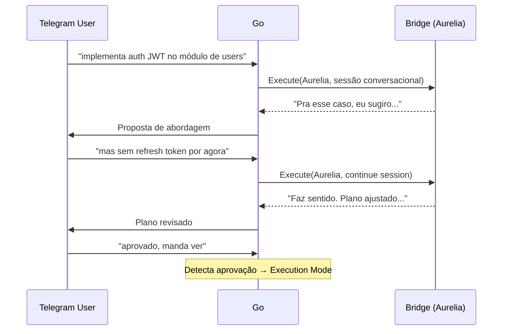
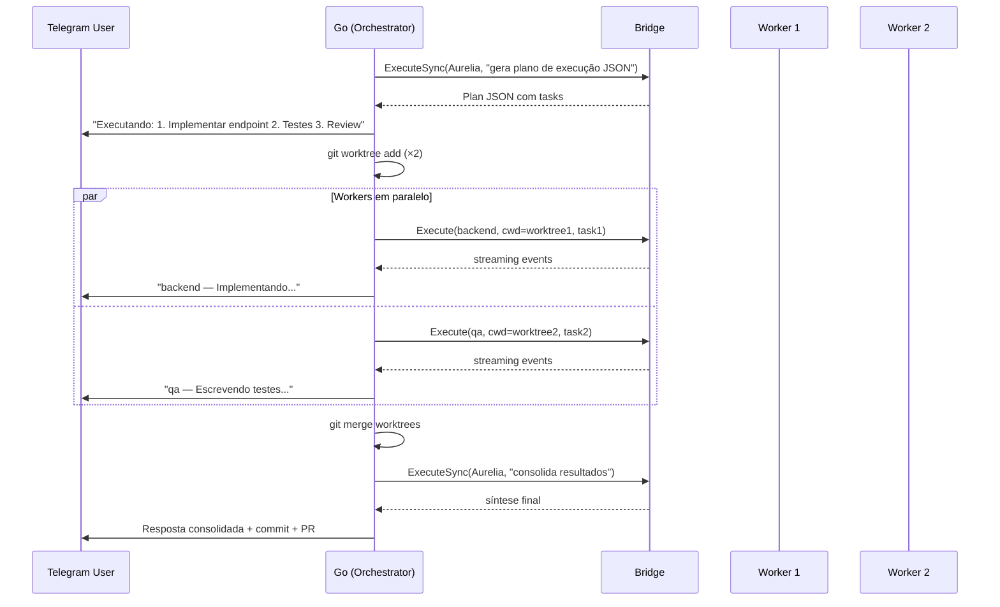
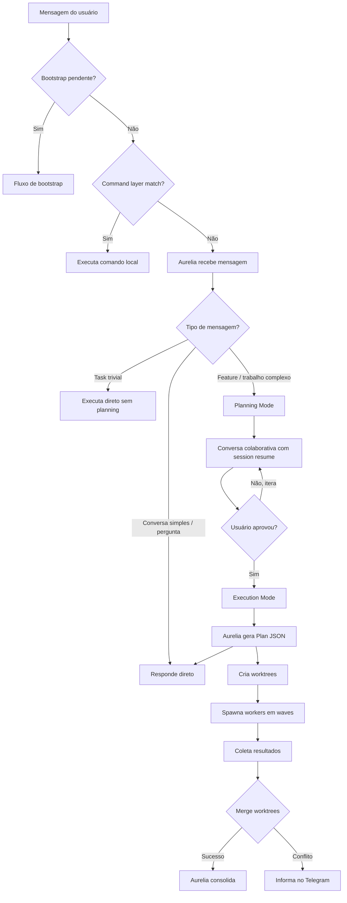

# Agent Orchestration — Design

**Spec**: `.specs/features/agent-orchestration/spec.md`
**Status**: Draft

---

## Architecture Overview

Dois modos de operação: **Planning Mode** (colaborativo, sessão conversacional) e **Execution Mode** (autônomo, múltiplas sessões bridge). O gatilho de transição é a aprovação do usuário.

### Planning Mode (sessão conversacional existente)



### Execution Mode (após aprovação)



### Fluxo de decisão



---

## Code Reuse Analysis

### Existing Components to Leverage

| Component | Location | Como usar |
|-----------|----------|-----------|
| `Bridge.Execute()` | `internal/bridge/bridge.go` | Spawnar workers — já suporta multiplexação concorrente via request_id, cwd diferente por request |
| `Bridge.ExecuteSync()` | `internal/bridge/bridge.go` | Fase 1 (planejamento) e Fase 3 (consolidação) — blocking, só precisa do resultado final |
| `progressReporter` | `internal/telegram/progress.go` | Adaptar pra status por worker — já edita mensagens em tempo real |
| `SendTextReply()` | `internal/telegram/output.go` | Enviar resposta final consolidada — já faz chunking e Markdown→HTML |
| `agents.Load()` | `internal/agents/registry.go` | Carregar worker.md — parsing de frontmatter YAML já funciona |
| `persona.BuildPrompt()` | `internal/persona/` | Montar system prompt da Aurelia orquestradora |
| `session.Store` | `internal/session/` | Manter sessão da Aurelia (orquestradora) entre mensagens |
| `bridgeFailureTracker` | `internal/telegram/input_pipeline.go` | Aplicar cooldown se bridge morrer durante workers |

### Integration Points

| Sistema | Método de integração |
|---------|---------------------|
| Bridge NDJSON | Mesma interface `Execute(ctx, Request)` — cada worker é uma request separada |
| Telegram Bot API | Mensagens de status via `bot.Send()` e `bot.Edit()` — padrão do progress reporter |
| Git | Comandos via `os/exec` — `git worktree add/remove`, `git merge`, `git commit` |
| GitHub CLI | Worker usa `gh` via Bash tool — PR creation/comments |

---

## Components

### Orchestrator Service

- **Purpose**: Coordena o ciclo completo: planejar → executar → consolidar
- **Location**: `internal/orchestrator/`
- **Interfaces**:

```go
// Orchestrator coordena o ciclo plan→execute→consolidate.
type Orchestrator struct {
    bridge   BridgeExecutor
    worktree WorktreeManager
    config   OrchestratorConfig
}

type OrchestratorConfig struct {
    WorkerSystemPrompt  string   // prompt do worker.md
    WorkerModel         string   // modelo padrão do worker
    WorkerTools         []string // ferramentas do worker
    WorkerMaxTurns      int      // default: 25
    OrchestratorPrompt  string   // prompt da Aurelia orquestradora
    MaxConcurrentWorkers int     // default: 3
}

// BridgeExecutor é a interface que o orchestrator precisa do bridge.
type BridgeExecutor interface {
    Execute(ctx context.Context, req bridge.Request) (<-chan bridge.Event, error)
    ExecuteSync(ctx context.Context, req bridge.Request) (*bridge.Event, error)
}

// ExtractPlan detecta se a resposta da Aurelia contém um plano de execução.
// O plano é emitido como bloco ```aurelia-plan\n{json}\n``` na resposta.
// Retorna nil se não há plano (resposta normal de conversa).
func (o *Orchestrator) ExtractPlan(response string) *Plan

// ExecutePlan spawna workers e coleta resultados.
// Resolve o config de cada task via ResolveAgentConfig(registry, task.Agent).
func (o *Orchestrator) ExecutePlan(ctx context.Context, plan *Plan, registry *agents.Registry, onEvent func(WorkerEvent)) ([]TaskResult, error)

// Consolidate sintetiza os resultados dos workers.
func (o *Orchestrator) Consolidate(ctx context.Context, plan *Plan, results []TaskResult, systemPrompt string) (string, error)
```

- **Dependencies**: `BridgeExecutor`, `WorktreeManager`
- **Reuses**: `bridge.Execute()` pra cada worker, `bridge.ExecuteSync()` pra planejamento e consolidação

---

### Plan (Data Model)

- **Purpose**: Plano estruturado retornado pela Aurelia na fase de decomposição
- **Location**: `internal/orchestrator/plan.go`

```go
// Plan é o plano de execução retornado pela Aurelia.
type Plan struct {
    Tasks []Task `json:"tasks"`
}

// Task é uma subtask atômica do plano.
type Task struct {
    ID            string   `json:"id"`             // "1", "2", "3"
    Description   string   `json:"description"`    // "Implementar endpoint GET /health"
    Agent         string   `json:"agent"`           // "worker", "qa", "code-reviewer" — qual agent usar
    Prompt        string   `json:"prompt"`          // Prompt completo pro agent
    DependsOn     []string `json:"depends_on"`      // ["1"] — task 2 depende da 1
    NeedsWorktree bool     `json:"needs_worktree"`  // true pra implementação, false pra review
}

// TaskResult é o resultado de um worker.
type TaskResult struct {
    TaskID     string
    Content    string  // texto retornado pelo worker
    Success    bool
    DurationMs int64
    CostUSD    float64
    Error      string  // se falhou
}

// WorkerEvent é emitido durante a execução pro feedback visual.
type WorkerEvent struct {
    TaskID    string
    Type      string // "start", "progress", "done", "error"
    ToolName  string // qual tool tá usando (progress)
    Message   string // descrição do progresso
}
```

**Resolução de dependências:**
```go
// ExecutionOrder retorna tasks agrupadas por wave (paralelas dentro da wave).
func (p *Plan) ExecutionOrder() [][]Task {
    // Wave 1: tasks sem dependências (paralelas)
    // Wave 2: tasks que dependem da wave 1 (paralelas entre si)
    // Wave N: ...
}
```

---

### Worktree Manager

- **Purpose**: Gerencia git worktrees — criar, limpar, fazer merge
- **Location**: `internal/orchestrator/worktree.go`

```go
type WorktreeManager struct {
    repoRoot string // raiz do repositório
}

type Worktree struct {
    Path   string // caminho absoluto do worktree
    Branch string // nome do branch (ex: "worker/task-1-implement-health")
}

// Create cria um worktree com branch isolado.
func (wm *WorktreeManager) Create(taskID string, baseBranch string) (*Worktree, error)

// Merge faz merge do branch do worktree de volta pro branch base.
func (wm *WorktreeManager) Merge(wt *Worktree, baseBranch string) error

// Cleanup remove o worktree e o branch temporário.
func (wm *WorktreeManager) Cleanup(wt *Worktree) error

// CleanupAll remove todos os worktrees temporários (recovery).
func (wm *WorktreeManager) CleanupAll() error
```

**Implementação interna:**
- `Create`: `git worktree add <path> -b <branch>` baseado no branch ativo
- `Merge`: `git merge --no-ff <branch>` no repo principal
- `Cleanup`: `git worktree remove <path>` + `git branch -d <branch>`
- Path pattern: `<repoRoot>/.worktrees/worker-<taskID>/`
- Branch pattern: `worker/<taskID>-<slug>`

- **Dependencies**: Git CLI via `os/exec`
- **Reuses**: Nenhum — componente novo

---

### Worker Status Reporter

- **Purpose**: Gerencia mensagens de status por worker no Telegram
- **Location**: `internal/telegram/worker_status.go`

```go
type workerStatusReporter struct {
    bot      *telebot.Bot
    chat     *telebot.Chat
    messages map[string]*telebot.Message // taskID → mensagem de status
    mu       sync.Mutex
}

// SendStart envia mensagem de status inicial.
func (r *workerStatusReporter) SendStart(taskID string, description string) error

// UpdateProgress edita mensagem com progresso.
func (r *workerStatusReporter) UpdateProgress(taskID string, toolName string) error

// MarkDone edita mensagem pra conclusão.
func (r *workerStatusReporter) MarkDone(taskID string, durationMs int64) error

// MarkError edita mensagem pra erro.
func (r *workerStatusReporter) MarkError(taskID string, errMsg string) error

// Cleanup remove mensagens de status (opcional, pra não poluir o chat).
func (r *workerStatusReporter) Cleanup()
```

**Formato das mensagens:**
- Start: `"⚙️ **Worker 1** — Implementando endpoint /health..."`
- Progress: `"⚙️ **Worker 1** — Editando internal/api/health.go..."`
- Done: `"✅ **Worker 1** — Concluído (12s)"`
- Error: `"❌ **Worker 1** — Falhou: timeout"`

- **Dependencies**: `telebot.Bot`
- **Reuses**: Padrão do `progressReporter` — `bot.Send()` pra criar, `bot.Edit()` pra atualizar

---

### Quality Gate (Validação)

- **Purpose**: Aurelia valida resultado de cada worker antes de aceitar merge
- **Location**: `internal/orchestrator/validate.go`

```go
type ValidationResult struct {
    Approved    bool     // true = pode fazer merge
    Issues      []string // problemas encontrados
    ShouldRetry bool     // true = spawnar worker de correção
}

// Validate chama Aurelia pra validar o resultado de um worker contra os critérios da task.
func (o *Orchestrator) Validate(ctx context.Context, task Task, result TaskResult, specContent string, designContent string) (*ValidationResult, error)
```

**O que Aurelia valida:**
- Critérios "Done When" da task foram atendidos?
- Testes passam? (pede pro worker rodar antes de retornar)
- Sem scope creep (tocou só os arquivos listados)?
- Sem overengineering?
- Segue padrões do CLAUDE.md?

**Fluxo:**
1. Worker retorna resultado
2. Go chama `Validate()` → Aurelia recebe resultado + task + spec + design
3. Se aprovado → merge worktree
4. Se reprovado com retry → spawna novo worker com feedback
5. Se reprovado 3x → escala pro usuário no Telegram

- **Dependencies**: `BridgeExecutor` (pra chamar Aurelia)
- **Reuses**: Padrão de `ExecuteSync()` pra chamadas blocking

---

### AGENTS.md Generator

- **Purpose**: Gerar/manter AGENTS.md na raiz do projeto com config do squad
- **Location**: `internal/orchestrator/agents_md.go`

```go
// EnsureAgentsMd verifica se AGENTS.md existe; se não, cria com config do squad.
func EnsureAgentsMd(repoRoot string, agents []AgentSummary) error

// EnsureClaudeMd verifica se CLAUDE.md existe; se não, cria com convenções básicas.
// Se já existe, não sobrescreve.
func EnsureClaudeMd(repoRoot string) error
```

**AGENTS.md template:**
```markdown
# AGENTS.md

## Squad

| Agent | Descrição | Tools | Modelo |
|-------|-----------|-------|--------|
| worker (default) | Generic worker | Read, Write, Edit, Bash, Grep, Glob | sonnet |
| qa | Test specialist | Read, Write, Edit, Bash, Grep, Glob | sonnet |
| ... | ... | ... | ... |

## Workflow

1. Planning: Aurelia especifica, desenha e cria tasks com o usuário
2. Execution: Workers executam tasks atômicas em worktrees isolados
3. Validation: Aurelia valida resultados antes de aceitar
4. Delivery: Merge, commit, PR

## Conventions

- Workers recebem: CLAUDE.md + AGENTS.md + spec.md + design.md + task
- Worktrees: `.worktrees/worker-<taskID>/`
- Branches: `worker/<taskID>-<slug>`
- Commits: Conventional Commits
```

- **Dependencies**: File system
- **Reuses**: Nenhum — geração simples de markdown

---

### Orchestrator Prompt Builder

- **Purpose**: Monta o system prompt da Aurelia em modo orquestradora
- **Location**: `internal/orchestrator/prompt.go`

```go
// BuildOrchestratorPrompt monta o system prompt da Aurelia.
// Inclui: metodologia TLC (Specify → Design → Tasks → Implement → Validate),
// instruções de Planning Mode (discutir, questionar, criar .specs/),
// instruções de Execution Mode (gerar plano JSON quando tasks aprovadas),
// regras anti-overengineering, e lista de agents disponíveis.
func BuildOrchestratorPrompt(persona string, projectContext string, availableAgents []AgentSummary) string

// AgentSummary é a descrição de um agent disponível pro planejamento.
type AgentSummary struct {
    Name        string   // "qa", "code-reviewer", "backend-architect"
    Description string   // "Writes and runs tests"
    Tools       []string // ["Read", "Write", "Edit", "Bash"]
    ReadOnly    bool     // true se só tem tools de leitura
}

// BuildExecutionPrompt monta o prompt pra gerar o plano de execução JSON.
// Inclui: tasks.md aprovado, agents disponíveis, JSON schema do Plan.
func BuildExecutionPrompt(tasksContent string, availableAgents []AgentSummary) string

// BuildValidationPrompt monta o prompt pra Aurelia validar resultado de um worker.
// Inclui: task original (com "Done When"), resultado do worker, spec.md e design.md.
func BuildValidationPrompt(task Task, workerResult TaskResult, specContent string, designContent string) string

// BuildConsolidationPrompt monta o prompt pra sintetizar resultados finais.
func BuildConsolidationPrompt(persona string, plan *Plan, results []TaskResult) string

// BuildWorkerPrompt monta o system prompt de um worker.
// Inclui: agent system prompt + CLAUDE.md + AGENTS.md + spec.md + design.md + task + siblings.
func BuildWorkerPrompt(agentPrompt string, claudeMd string, agentsMd string, specContent string, designContent string, task Task, siblings []Task) string
```

- **Dependencies**: `persona.BuildPrompt()`
- **Reuses**: Padrão de prompt assembly de `input_pipeline.go`

---

### Integration: Input Pipeline

- **Purpose**: Conectar o orchestrator ao fluxo existente do Telegram
- **Location**: `internal/telegram/input_pipeline.go` (modificação)

```go
// Mudança no processInput():
// Planning Mode: fluxo conversacional existente (executeAsync).
// Execution Mode: ativado quando Aurelia detecta aprovação do usuário.
//
// A Aurelia roda no mesmo fluxo de sempre (sessão conversacional com resume).
// Quando detecta aprovação, o Go intercepta e entra em Execution Mode.

func (bc *BotController) processInput(c telebot.Context, text string) error {
    // ... bootstrap, command layer (existente) ...

    // Planning Mode: Aurelia conversa normalmente (fluxo existente).
    // A resposta da Aurelia pode incluir um marcador de "plano aprovado"
    // que o Go detecta pra entrar em Execution Mode.
    go bc.executeAsync(chatID, messageID, req, text)
    return nil
}

// processBridgeEventsAsync (modificação):
// Após receber resultado do bridge, checa se contém plano de execução.
// Se sim, entra em Execution Mode automaticamente.
func (bc *BotController) processBridgeEventsAsync(...) bridgeOutcome {
    // ... processa eventos normalmente (existente) ...

    case "result":
        // NOVO: Checa se o resultado contém um plano de execução
        if plan := bc.orchestrator.ExtractPlan(ev.Content); plan != nil {
            // Transição pra Execution Mode
            go bc.executeApprovedPlan(chat, messageID, plan)
            return outcomeSuccess
        }
        // Senão, envia resposta normal (existente)
        SendTextReply(bc.bot, chat, finalText, messageID)
}

// executeApprovedPlan executa um plano aprovado pelo usuário.
// Segue o ciclo TLC: Implement → Validate → Merge/Retry → Consolidate.
func (bc *BotController) executeApprovedPlan(chat *telebot.Chat, messageID int, plan *Plan) {
    ctx, cancel := context.WithTimeout(context.Background(), 15*time.Minute)
    defer cancel()

    // 0. Garantir CLAUDE.md e AGENTS.md existem
    orchestrator.EnsureClaudeMd(repoRoot)
    orchestrator.EnsureAgentsMd(repoRoot, availableAgents)

    // 1. Informar plano no Telegram
    bc.sendPlanSummary(chat, plan, messageID)

    // 2. Executar workers por fase (respeitando dependências)
    status := newWorkerStatusReporter(bc.bot, chat)
    for _, wave := range plan.ExecutionOrder() {
        var wg sync.WaitGroup
        for _, task := range wave {
            wg.Add(1)
            go func(t Task) {
                defer wg.Done()

                // Resolve agent config (especialista → worker.md → default)
                agentCfg := orchestrator.ResolveAgentConfig(bc.agents, t.Agent)

                // Cria worktree se necessário
                var wt *Worktree
                if t.NeedsWorktree {
                    wt, _ = bc.worktree.Create(t.ID, currentBranch)
                }
                cwd := repoRoot
                if wt != nil {
                    cwd = wt.Path
                }

                // Monta prompt do worker com contexto completo
                workerPrompt := BuildWorkerPrompt(agentCfg.Prompt, claudeMd, agentsMd, specContent, designContent, t, wave)

                // Spawna worker
                status.SendStart(t.ID, t.Description)
                result := bc.orchestrator.ExecuteTask(ctx, t, agentCfg, cwd, workerPrompt, func(ev WorkerEvent) {
                    status.UpdateProgress(ev.TaskID, ev.ToolName)
                })

                // 3. Quality Gate — Aurelia valida
                validation, _ := bc.orchestrator.Validate(ctx, t, result, specContent, designContent)

                if validation.Approved {
                    status.MarkDone(t.ID, result.DurationMs)
                    if wt != nil {
                        bc.worktree.Merge(wt, currentBranch)
                    }
                } else if validation.ShouldRetry {
                    // Retry com feedback (max 3x, senão escala pro usuário)
                    status.MarkError(t.ID, "Correções necessárias, retentando...")
                    // ... retry loop ...
                } else {
                    status.MarkError(t.ID, strings.Join(validation.Issues, "; "))
                }

                // Cleanup worktree
                if wt != nil {
                    bc.worktree.Cleanup(wt)
                }
            }(task)
        }
        wg.Wait() // Espera wave completar antes da próxima
    }

    // 4. Atualizar tasks.md com status
    bc.orchestrator.UpdateTasksStatus(plan, results)

    // 5. Consolidar e responder
    finalResponse, _ := bc.orchestrator.Consolidate(ctx, plan, results, systemPrompt)
    SendTextReply(bc.bot, chat, finalResponse, messageID)

    // 6. Commit + PR se aplicável
    // ... git commit, gh pr create ...
}
```

- **Reuses**: `processInput()` existente como fallback quando não há agents

---

### Worker Default (Hardcoded) + Override via `.md`

- **Purpose**: Worker genérico embutido no código. Orquestração é capacidade core, não opt-in.
- **Location**: `internal/orchestrator/defaults.go`

```go
// DefaultWorkerConfig é o worker embutido. Funciona sem nenhum .md.
var DefaultWorkerConfig = WorkerConfig{
    Model:    "sonnet",
    MaxTurns: 25,
    Tools:    []string{"Read", "Write", "Edit", "Bash", "Grep", "Glob"},
    Prompt: `You are an implementation worker in a software development squad.

You receive atomic tasks from the orchestrator and execute them thoroughly.

Rules:
- Focus exclusively on the assigned task
- Do not make changes outside the scope of your task
- Use conventional commits if asked to commit
- Report completion clearly with a summary of what was done
- If blocked, explain what's blocking and what you tried`,
}

// ResolveAgentConfig retorna o config do agent pra uma task.
// 1. Se task.Agent existe no registry → usa o .md dele
// 2. Se task.Agent == "worker" ou não existe → usa default hardcoded
// 3. Se worker.md existir → sobrescreve o default
func ResolveAgentConfig(registry *agents.Registry, agentName string) WorkerConfig {
    // Agent especialista existe?
    if agentName != "" && agentName != "worker" {
        if a := registry.Get(agentName); a != nil {
            return agentToWorkerConfig(a)
        }
    }
    // Fallback: worker default, com override se worker.md existir
    if w := registry.Get("worker"); w != nil {
        return mergeWorkerConfig(DefaultWorkerConfig, w)
    }
    return DefaultWorkerConfig
}
```

**Customização opcional via `~/.aurelia/agents/worker.md`:**
```yaml
---
name: worker
description: Custom worker override
model: opus
max_turns: 40
tools:
  - Read
  - Write
  - Edit
  - Bash
  - Grep
  - Glob
  - WebSearch
---
Custom worker instructions here...
```

- **Reuses**: Formato `.md` do agent registry pra override opcional

---

## Data Models

### Agent Struct (atualizado)

```go
// internal/agents/types.go — campos novos
type Agent struct {
    Name           string         `yaml:"name"`
    Description    string         `yaml:"description"`
    Model          string         `yaml:"model,omitempty"`
    Schedule       string         `yaml:"schedule,omitempty"`
    Cwd            string         `yaml:"cwd,omitempty"`
    MCPServers     map[string]any `yaml:"mcp_servers,omitempty"`
    AllowedTools   []string       `yaml:"allowed_tools,omitempty"`
    DisallowedTools []string      `yaml:"disallowed_tools,omitempty"` // NOVO
    MaxTurns       int            `yaml:"max_turns,omitempty"`        // NOVO
    Prompt         string         `yaml:"-"`
}
```

### BuildSDKAgents (atualizado)

```go
// internal/agents/sdk.go — campos novos
func BuildSDKAgents(r *Registry) map[string]any {
    for _, a := range all {
        def := map[string]any{
            "description": a.Description,
            "prompt":      a.Prompt,
        }
        if a.Model != "" {
            def["model"] = a.Model
        }
        if len(a.AllowedTools) > 0 {
            def["tools"] = a.AllowedTools
        }
        if len(a.DisallowedTools) > 0 {
            def["disallowedTools"] = a.DisallowedTools  // NOVO
        }
        if a.MaxTurns > 0 {
            def["maxTurns"] = a.MaxTurns  // NOVO
        }
        result[a.Name] = def
    }
    return result
}
```

---

## Error Handling Strategy

| Cenário | Tratamento | Impacto no usuário |
|---------|------------|-------------------|
| Aurelia retorna JSON malformado na fase 1 | Retry 1x com prompt reforçado, depois fallback pra fluxo direto (sem orquestração) | "Não consegui decompor, vou tentar direto" |
| Worker falha (erro/timeout) | Marca task como falha, continua com outros workers, reporta falha parcial | "Worker 2 falhou: timeout. Workers 1 e 3 completaram." |
| Bridge morre durante workers | Recovery existente + cleanup de worktrees | "Reconectando..." (fluxo existente) |
| Merge de worktree com conflito | Tenta `git merge --no-ff`, se falhar informa e mantém branches | "Conflito no merge de worker-1. Branch mantido: worker/task-1-..." |
| Git worktree creation falha | Fallback: executa no diretório principal (sem isolamento) | Worker roda sem worktree, risco de conflito |
| Todas as tasks falham | Reporta erro geral | "Nenhum worker completou com sucesso. Erros: ..." |
| Rate limit do Telegram em status updates | Logar, continuar sem atualizar status | Status fica desatualizado mas execução continua |

---

## Tech Decisions

| Decisão | Escolha | Justificativa |
|---------|---------|---------------|
| Onde colocar o orchestrator | Novo pacote `internal/orchestrator/` | Responsabilidade distinta do telegram handler, testável isoladamente |
| Como Aurelia retorna o plano | JSON via structured output (schema no prompt) | SDK não suporta `outputFormat` no `query()` facilmente; JSON no prompt é pragmático e testável |
| Worktree path | `.worktrees/worker-<taskID>/` dentro do repo | Fácil de limpar, não polui o projeto, git ignora automaticamente |
| Comunicação workers→Go | Event channel existente do bridge | Já funciona, já multiplexado, sem overhead novo |
| Execução paralela vs sequencial | Parallel por wave (respeitando dependências) | Bridge já suporta requests concorrentes; max 3 paralelos pra não sobrecarregar |
| Quando usar orquestração | Sempre — Aurelia decide se decompõe ou responde direto | Capacidade core, não opt-in. Worker default hardcoded, `worker.md` sobrescreve se existir |
| Como detectar plano aprovado | Marcador `aurelia-plan` em code block na resposta da Aurelia | Aurelia emite plano JSON dentro de ` ```aurelia-plan ` quando usuário aprova. Go detecta via `ExtractPlan()`, filtra o bloco antes de enviar pro Telegram |
| Planning vs Execution Mode | Mesma sessão bridge, transição por marcador | Planning usa fluxo conversacional existente (session resume). Execution é ativado quando Go detecta o marcador no resultado |
| Modelo da Aurelia orquestradora | Mesmo modelo do config global (default: sonnet) | Planejamento não precisa de opus; se precisar, configura via app.json |
| Worker stateless | Sem session resume entre tasks | Cada task é independente — simplifica, evita session leaking |
| Metodologia TLC integrada | Aurelia segue Specify → Design → Tasks → Implement → Validate | Mesmo workflow que o skill TLC, mas dentro da Aurelia como comportamento nativo |
| Artefatos como contexto | Workers recebem CLAUDE.md + AGENTS.md + spec + design + task | Contexto estruturado evita workers "perdidos" — sabem o que fazer e por quê |
| Quality gate obrigatório | Aurelia valida cada worker antes de merge | Evita merge cego. Retry automático até 3x, depois escala pro usuário |
| CLAUDE.md preservado | Se existe, não sobrescreve | Projetos existentes mantêm suas convenções. Aurelia só cria se não existir |
