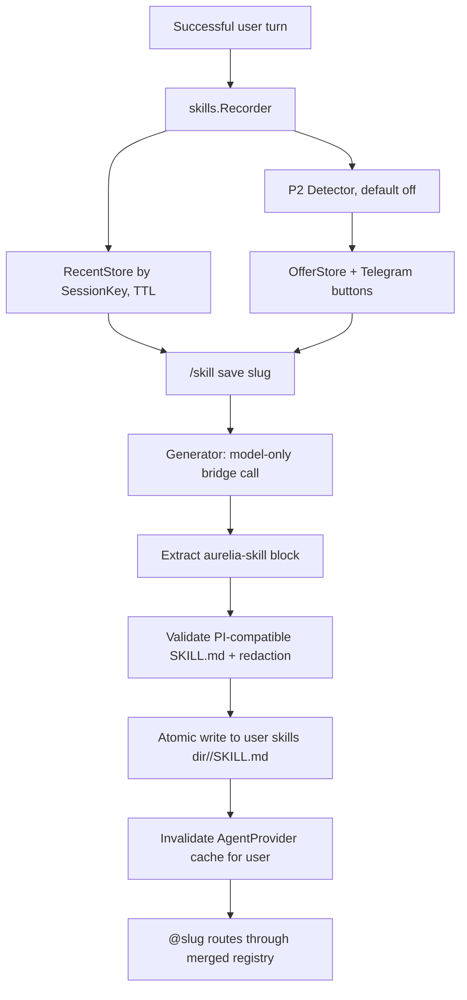

# Auto-Skills — Design

**Spec:** `.specs/features/auto-skills/spec.md`
**Status:** Revised after code review

---

## Architecture Overview

Auto-Skills cria **skills PI-compatible, mas Aurelia-managed** privadas por usuário. Elas usam o layout de skills do PI (`<slug>/SKILL.md`) para representar procedimentos reutilizáveis, mas são descobertas e roteadas pelo `AgentProvider` per-user do Aurelia no MVP. O Aurelia não instala `pi-hermes-memory`, não escreve em `~/.pi/agent/skills` e não depende do discovery global do PI para evitar vazamento entre usuários e duplicidade de fontes de memória.



Code facts guiding the design:

- PI skills are self-contained capability packages with a required `SKILL.md`; only descriptions should be always visible, and full procedures load on demand.
- `internal/agents.Load(dir)` currently loads one directory and parses `name`, `description`, `model`, `schedule`, `cwd`, `mcp_servers`, `allowed_tools`, `disallowed_tools`, `max_turns`.
- Agent Skills/PI frontmatter uses `allowed-tools`; the Aurelia adapter must map it to the internal `allowed_tools` representation or expose a normalized capability model.
- Unknown frontmatter fields are ignored today, so `tools` would not restrict tools.
- `cmd/aurelia/app.go` loads the registry once from `resolver.Agents()`.
- `bridge/index.ts` loads PI resources from `agentDir` and supports `NoUserSettings`, but no per-request user skill dir.
- `ProcessBridgeEvents` receives tool events, including `Event.Input`, so transcript capture can be implemented in Go without bridge changes.

### Why not `pi-hermes-memory` in MVP

`pi-hermes-memory` has useful concepts — facts, user profile, session search, secret scanning and procedural skills — but enabling it directly would add a second memory backend with PI-global defaults. Aurelia needs Telegram-scoped `user_id/chat_id/thread_id`, project binding, approval UX and guard-rails as the source of truth. The MVP therefore reuses the **format/concept** of PI skills, not an external PI memory extension.

---

## Component Changes

### 1. User paths

User Isolation must provide a resolver method equivalent to:

```go
func (r *PathResolver) UserSkillsDir(userID int64) string {
    return filepath.Join(r.Root(), "users", strconv.FormatInt(userID, 10), "skills")
}
```

Each skill is stored as `UserSkillsDir(userID)/<slug>/SKILL.md`. Directories should be private (`0700`), skill files `0600`. If the final User Isolation resolver names this differently, Auto-Skills should depend on that API instead of inventing a second path convention.

### 2. New package `internal/skills/`

**Files:**

- `types.go` — `TurnTranscript`, `ToolDigest`, `Stats`, service interfaces
- `redact.go` — deterministic redaction before LLM/storage
- `recent.go` — in-memory TTL store for manual capture
- `recorder.go` — event observer for pipeline
- `prompt.go` — `BuildSkillCapturePrompt`, `ExtractSkillBlock`
- `validator.go` — PI-compatible frontmatter/body validation + Aurelia normalization
- `generator.go` — bridge call + retry
- `writer.go` — atomic filesystem writes
- `service.go` — orchestration used by Telegram/pipeline
- `detector.go`, `offer.go`, `offer_sqlite.go` — P2 auto-offer

### 3. Transcript recorder

Transcript is a digest, not a raw session dump.

```go
type TurnTranscript struct {
    Key          session.SessionKey
    TurnID       string
    UserText     string
    FinalText    string
    AgentName    string
    Model        string
    CWD          string
    Tools        []ToolDigest
    Stats        Stats
    StartedAt    time.Time
    CompletedAt  time.Time
    Redacted     bool
}

type ToolDigest struct {
    Name          string
    InputSnippet  string
    ResultSnippet string
    StartedAt     time.Time
    EndedAt       *time.Time
}

type Stats struct {
    ToolCallCount int
    UniqueTools   int
    Duration      time.Duration
    Succeeded     bool
}
```

Rules:

- no full system prompt
- no owner playbook
- max transcript size default 64KB
- max tool input/result snippet default 2KB each
- redaction runs before saving to `RecentStore`
- only successful user-facing turns replace the recent transcript
- generator, dream, validation and other internal bridge calls are not capturable

`tool_result` events do not currently include tool id in `bridge.Event`; MVP can attach the result to the most recent open tool digest. If the bridge later emits IDs, update recorder to match by ID.

### 4. RecentStore

Manual MVP uses in-memory storage with TTL. This keeps privacy risk lower and avoids persisting transcripts unless the user asks to create a skill.

```go
type RecentStore interface {
    Save(key session.SessionKey, transcript *TurnTranscript)
    Get(key session.SessionKey) (*TurnTranscript, bool)
    Delete(key session.SessionKey)
    GC(now time.Time) int
}
```

Default TTL: 30 minutes. A daemon restart losing recent transcript is acceptable for MVP; P2 offers persist transcript only after a candidate offer is created.

### 5. Redaction

Redaction is deterministic and happens before generator:

- `(?i)(api[_-]?key|token|secret|password)\s*[:=]\s*\S+`
- common bearer tokens
- `sk-...` style keys
- long high-entropy strings
- `.env` assignment values

Prompt redaction alone is not enough. Validator/writer also scans final content and rejects remaining obvious secrets.

### 6. Generator

The generator is model-only. It should not read files or call tools to create the skill.

```go
type Generator struct {
    bridge Bridge
    cfg    GeneratorConfig
}

func (g *Generator) Generate(ctx context.Context, t *TurnTranscript, slug string) (string, error) {
    req := bridge.Request{
        Command: "query",
        Prompt:  BuildSkillCapturePrompt(t, slug),
        Options: bridge.RequestOptions{
            Model:          g.cfg.Model,
            Provider:       g.cfg.Provider,
            NoUserSettings: true,
            // Preferred implementation: add NoTools bool to RequestOptions.
            // Fallback: DisallowedTools = all known built-ins.
            DisallowedTools: allBuiltinToolNames(),
        },
    }
    // ExecuteSync, extract aurelia-skill, validate, retry with structured error.
}
```

Adding a first-class `NoTools bool` to the bridge protocol is cleaner than relying on denylist semantics. If implemented, it must map to `tools: []` in `createAgentSession`.

### 7. Skill capture prompt

The prompt must output a markdown file wrapped in one fenced block:

````markdown
```aurelia-skill
---
name: backup-cron
description: Recreate the validated backup cron workflow.
model: kimi-k2
capability_profile: execute_safe
allowed-tools: Read Bash
metadata:
  aurelia:
    kind: auto_skill
    created_by: auto-skill
    created_at: 2026-05-17T10:00:00Z
    source_hash: <hash>
---

# Backup Cron

## Procedure

1. ...

## Pitfalls

- ...

## Verify

- ...
```
````

`metadata.aurelia.source_hash` is a hash of the redacted transcript, not raw chat/user identifiers. The writer can add/normalize metadata after validation, so the LLM does not need to be trusted to set all fields. Top-level `source_hash` is not required and should be normalized into `metadata.aurelia` if generated by mistake.

### 8. Validator

Validator should parse PI-compatible `SKILL.md` frontmatter and normalize it into the internal agent model. Prefer exposing `agents.Parse(data []byte)` plus an adapter, rather than duplicating parsing. The adapter is responsible for mapping `allowed-tools` to Aurelia's internal tool representation.

Validation rules:

- `name` equals requested slug
- `description` non-empty and short
- `allowed-tools` only uses known Aurelia/PI tool names
- `tools` is invalid; retry with explicit correction
- `schedule`, `cwd`, `mcp_servers`, `max_turns` are not allowed in generated skills for MVP
- body contains `Procedure`, `Pitfalls`, `Verify`
- total content under size limit, default 24KB
- no obvious secret remains after redaction scan
- output path is `<slug>/SKILL.md`, not `<slug>.md`

Unknown metadata should be rejected for auto-generated skills, even if global agents tolerate unknown fields.

### 9. Writer

```go
type Writer struct {
    resolver UserSkillResolver
}

func (w *Writer) Save(ctx context.Context, userID int64, slug string, content []byte, mode SaveMode) (string, error)
```

Rules:

- validate slug before path join
- create user skills dir and skill directory `0700`
- refuse symlink overwrite
- no overwrite unless mode is explicit overwrite after confirmation
- write `SKILL.md` via temp file in the same skill dir with `0600`
- `fsync` best-effort, then `os.Rename`
- return absolute path
- invalidate agent cache after success

### 10. Agent registry per-user

Avoid mutating a singleton registry for every turn. Introduce an immutable provider:

```go
type AgentProvider interface {
    ForUser(ctx context.Context, userID int64) (*agents.Registry, error)
    InvalidateUser(userID int64)
}
```

Implementation:

- load global agents from `resolver.Agents()`
- load user skills from `UserSkillsDir(userID)/*/SKILL.md`
- adapt PI-compatible frontmatter/body into `agents.Agent`
- missing dirs are okay
- if skill name collides with global agent, keep global and mark skill invalid/colliding
- cache by `userID` with mtime or explicit invalidation after write/delete/rename

`agents.Agent` needs metadata fields:

```go
type Agent struct {
    // existing fields...
    CapabilityProfile string            `yaml:"capability_profile,omitempty"`
    Metadata          map[string]any    `yaml:"metadata,omitempty"`
    Source            string            `yaml:"-"`
    Path              string            `yaml:"-"`
}
```

`/agents` should call provider for the current `userID`, not use the startup singleton directly.

### 11. Commands

New slash routes:

- `/skill save <slug>` and `/skills save <slug>`
- `/skills`
- `/skills show <slug>`
- `/skills delete <slug>`
- `/skills rename <old> <new>`

All pass through `UserGate`. Commands operate only on current user’s private directory.

Manual save flow:

1. validate slug and collisions
2. fetch recent transcript by `SessionKey`
3. call generator
4. validate generated content
5. write atomic file
6. invalidate provider cache
7. reply with skill name and suggested usage `@slug`

### 12. P2 detector and offers

Default config:

```json
{
  "skills": {
    "manual_capture_enabled": true,
    "recent_ttl_minutes": 30
  },
  "auto_skills": {
    "enabled": false,
    "min_tool_calls": 5,
    "min_duration_seconds": 60,
    "min_tool_diversity": 3,
    "offer_ttl_minutes": 5
  }
}
```

Offer state persists because the user may click a button after process restart:

```sql
CREATE TABLE IF NOT EXISTS skill_offers (
    offer_id       TEXT PRIMARY KEY,
    chat_id        INTEGER NOT NULL,
    thread_id      INTEGER NOT NULL,
    user_id        INTEGER NOT NULL,
    state          TEXT NOT NULL,
    summary        TEXT NOT NULL,
    suggested_slug TEXT,
    final_slug     TEXT,
    transcript     TEXT NOT NULL,
    created_at     INTEGER NOT NULL,
    expires_at     INTEGER NOT NULL
);
```

Unlike `RecentStore`, persisted offer transcripts must already be redacted and capped.

### 13. Pipeline integration

Pipeline changes after User Isolation:

- `pipelineInput` includes `UserID`
- route agent through `AgentProvider.ForUser(input.UserID)`
- recorder starts after agent/model/cwd are known
- event loop calls `recorder.Observe(ev)`
- on success, `skills.SaveRecentTranscript(key, recorder.Transcript())`
- skill generation/internal bridge calls mark themselves non-capturable
- P2 `EvaluateAndOffer` runs after user reply is sent, never before

---

## Error Handling

| Cenário | Tratamento | UX |
|---|---|---|
| Sem transcript recente | recusa | “Não tenho uma execução recente para transformar em skill.” |
| Slug inválido | recusa | mostra formato esperado |
| Colisão com agent global | bloqueia | pede outro nome |
| Colisão com skill do usuário | pede overwrite/rename | confirmação explícita |
| Generator usa formato `tools` | retry estruturado | se falhar 2x, informa erro |
| Secret detectado no resultado | recusa salvar | pede regenerar ou editar |
| Diretório user ausente | cria `0700` | silencioso |
| Symlink no destino | recusa | mensagem de segurança |
| Registry encontra skill inválida | ignora no roteamento, mostra em `/skills` | não quebra `/agents` |
| Auto-offer expirou | GC remove | silencioso |

---

## Tech Decisions

| Decisão | Escolha | Justificativa |
|---|---|---|
| Tipo de skill MVP | Aurelia-managed, PI-compatible `SKILL.md` | Reaproveita procedimento/portabilidade do PI sem perder escopo do Aurelia |
| Discovery PI-native | P3 opcional | Bridge não tem skill dir per-user por request; evitar `~/.pi/agent` global |
| `pi-hermes-memory` | Fora do MVP | Evita segunda memória concorrente e escopo global por padrão |
| Transcript | digest redigido, sem system prompt | Reduz vazamento de persona/owner/config |
| Manual-first | Sim | Entrega valor sem spam |
| Auto-offer default | Off | Precisa calibrar com uso real |
| Frontmatter | Agent Skills/PI `allowed-tools` + adapter Aurelia | Formato portável; adapter normaliza para guard-rails/registry |
| Shadow global | Bloquear | Evita spoofing e regressão de roteamento |
| Writer | atomic rename + no symlink overwrite | Evita arquivo parcial e path tricks |
| Registry | provider immutable per-user | Evita race em singleton global |
| Generated schedule/cwd | Proibido no MVP | Auto-skill é prompt reutilizável, não automação |

---

## Testing Strategy

| Test | Where | Validates |
|---|---|---|
| `TestRecorder_CapturesSuccessfulTurn` | `internal/skills/recorder_test.go` | tool_use/result/final/stats |
| `TestRecorder_DoesNotStoreSystemPrompt` | same | privacidade |
| `TestRedact_Secrets` | `redact_test.go` | tokens/env/passwords |
| `TestRecentStore_IsolatedBySessionKey` | `recent_test.go` | usuário/tópico isolado |
| `TestExtractSkillBlock` | `prompt_test.go` | fenced block |
| `TestValidator_RejectsToolsField` | `validator_test.go` | alinhamento com loader |
| `TestValidator_RejectsScheduleAndUnknownTools` | same | segurança |
| `TestValidator_MapsAllowedTools` | same | `allowed-tools` PI → modelo interno Aurelia |
| `TestGenerator_NoToolsRequest` | `generator_test.go` | request model-only |
| `TestWriter_AtomicNoOverwrite` | `writer_test.go` | atomicidade e colisão em `<slug>/SKILL.md` |
| `TestWriter_DoesNotWritePiGlobalDir` | `writer_test.go` | storage privado em `~/.aurelia/users/...` |
| `TestAgentProvider_UserSkillsIsolated` | `internal/agents/...` | user A/B |
| `TestAgentProvider_GlobalCollisionBlocked` | same | sem shadow |
| `TestPipeline_StoresRecentTranscript` | `internal/pipeline/...` | recorder integrado |
| `TestSkillSaveCommand_HappyPath` | `internal/telegram/...` | comando manual |
| `TestSkillsCommands_CRUD` | same | list/show/delete/rename |
| `TestAutoOffer_DefaultOff` | `internal/skills/...` | P2 não spamma |

---

## Rollout

1. **Prereqs:** User Isolation path/`SessionKey`/`UserGate`.
2. **Foundation:** `internal/skills` types, redaction, recorder, recent store.
3. **Generator:** prompt, extract, no-tools bridge option or denylist fallback, validator.
4. **Writer:** atomic private storage.
5. **Registry:** `AgentProvider` per-user, metadata fields, `/agents` per-user.
6. **Manual commands:** `/skill save`, `/skills` list/show/delete/rename.
7. **Pipeline:** recorder and recent transcript lifecycle.
8. **P2 auto-offer:** detector, offer store, callbacks, config default off.
9. **Validation/release:** tests, smoke, version/changelog proposal for Igor.
