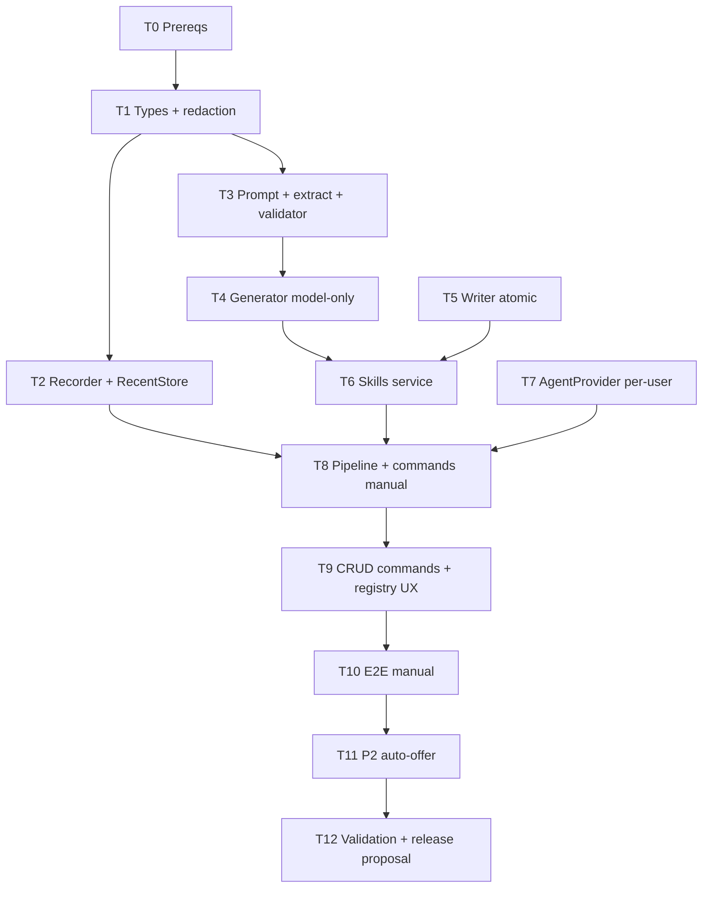

# Auto-Skills — Tasks

**Design:** `.specs/features/auto-skills/design.md`
**Status:** Revised after code review

> Depende de User Isolation entregar `TurnContext`, `SessionKey`, `UserGate` e diretório privado por `user_id`.
> MVP gera skills PI-compatible (`<slug>/SKILL.md`), mas Aurelia-managed e privadas por `user_id`; não escreve em `~/.pi/agent` nem usa `pi-hermes-memory`.

---

## Execution Plan

---

## Task Breakdown

### T0: Confirmar contratos de User Isolation

**What:** Travar APIs que Auto-Skills consome.
**Where:** `.specs/features/multi-user-profiles/*`
**Depends on:** None

**Done when:**

- [ ] `TurnContext.UserID` disponível em comandos e pipeline
- [ ] `SessionKey{chatID, threadID, userID}` definido
- [ ] `UserGate` disponível para comandos protegidos
- [ ] resolver expõe diretório privado de skills por `user_id`
- [ ] `/forget-me` tem hook para apagar skills privadas

**Verify:** Review de spec/contrato antes de iniciar código.

---

### T1: `internal/skills/types.go` + `redact.go`

**What:** Definir modelos base e redaction determinístico.
**Where:** `internal/skills/types.go`, `internal/skills/redact.go`
**Depends on:** T0

**Done when:**

- [ ] `TurnTranscript`, `ToolDigest`, `Stats`, configs e erros definidos
- [ ] Transcript usa `session.SessionKey`
- [ ] Redactor cobre tokens, password/secret/api_key, bearer, env values e strings high-entropy
- [ ] Redactor retorna marcador `<REDACTED:kind>`
- [ ] Tests table-driven para redaction

**Verify:** `go test ./internal/skills/... -run 'TestRedact|TestTypes' -v`

---

### T2: `recorder.go` + `recent.go`

**What:** Capturar digest de turnos e guardar último sucesso por `SessionKey`.
**Where:** `internal/skills/recorder.go`, `internal/skills/recent.go`
**Depends on:** T1

**Done when:**

- [ ] Recorder inicia com user text, agent, model, cwd
- [ ] `Observe` captura `tool_use`, `tool_result`, `assistant`, `result`
- [ ] tool result sem ID é associado ao último tool aberto
- [ ] Caps aplicados: transcript total, input/result snippets, final text
- [ ] `Stats` calcula duração, tool calls e diversidade
- [ ] RecentStore tem TTL default 30m e isolamento por user
- [ ] Failed/canceled/internal turns não substituem o último sucesso

**Verify:** `go test ./internal/skills/... -run 'TestRecorder|TestRecentStore' -v`

---

### T3: `prompt.go`, `extract.go`, `validator.go`

**What:** Prompt de geração, extração de `aurelia-skill` e validação do markdown.
**Where:** `internal/skills/prompt.go`, `internal/skills/validator.go`
**Depends on:** T1

**Done when:**

- [ ] `BuildSkillCapturePrompt` inclui transcript redigido e formato correto
- [ ] Prompt usa Agent Skills/PI `allowed-tools`, não `tools`
- [ ] `ExtractSkillBlock` parseia fenced block
- [ ] Validator parseia frontmatter PI-compatible e normaliza para o modelo interno do Aurelia
- [ ] Validator rejeita `tools`, `schedule`, `cwd`, `mcp_servers`, unknown tools e secrets restantes
- [ ] Validator exige seções `Procedure`, `Pitfalls`, `Verify`
- [ ] Validator/adapter mapeia `allowed-tools` para as tools internas usadas por guard-rails/registry
- [ ] Tests cobrem happy path e rejeições

**Verify:** `go test ./internal/skills/... -run 'TestBuildSkillCapture|TestExtractSkill|TestValidator' -v`

---

### T4: Bridge no-tools + `generator.go`

**What:** Garantir geração model-only e implementar retries.
**Where:** `internal/bridge/protocol.go`, `bridge/index.ts`, `internal/bridge/bundle.js` rebuild se bridge mudar, `internal/skills/generator.go`
**Depends on:** T3

**Done when:**

- [ ] Preferido: `RequestOptions.NoTools bool` adicionado e mapeado para `tools: []`
- [ ] Fallback aceitável: helper usa `DisallowedTools` com todos os built-ins
- [ ] Generator usa `NoUserSettings=true`
- [ ] Generator não é capturado pelo recorder
- [ ] Retry até 2 tentativas em parse/validation failure com feedback estruturado
- [ ] Tests com fake bridge verificam request sem tools
- [ ] Se `bridge/index.ts` mudar, rebuild: `cd bridge && npm run build && cp bundle.js ../internal/bridge/bundle.js`

**Verify:** `go test ./internal/skills/... ./internal/bridge/... -run 'TestGenerator|TestNoTools' -v`

---

### T5: `writer.go` — storage privado e atômico

**What:** Escrever skill validada em diretório privado do usuário.
**Where:** `internal/skills/writer.go`
**Depends on:** T0, T3

**Done when:**

- [ ] Slug kebab-case validado antes de path join
- [ ] User skills dir e `<slug>/` criados `0700`
- [ ] `SKILL.md` escrito `0600`
- [ ] Temp file + rename atômico
- [ ] No overwrite sem confirmação explícita
- [ ] Symlink overwrite recusado
- [ ] Retorna path absoluto
- [ ] Tests cobrem save, collision, overwrite, symlink, invalid slug

**Verify:** `go test ./internal/skills/... -run TestWriter -v`

---

### T6: `skills.Service`

**What:** Serviço de aplicação para manual capture e P2 futuro.
**Where:** `internal/skills/service.go`
**Depends on:** T2, T4, T5

**Done when:**

- [ ] `NewService` recebe recorder config, recent store, generator, writer
- [ ] `SaveRecentTranscript(key, transcript)` aplica regras de sucesso
- [ ] `SaveManualSkill(ctx, key, slug, overwrite)` coordena fetch/generate/validate/write
- [ ] Erros distinguem no transcript, slug inválido, colisão global, colisão local, generator, validator, writer
- [ ] Hook `InvalidateUser(userID)` disponível para provider
- [ ] Tests unitários do service manual

**Verify:** `go test ./internal/skills/... -run TestService_SaveManualSkill -v`

---

### T7: Agent registry per-user

**What:** Criar provider/carga merged sem mutar singleton global.
**Where:** `internal/agents/registry.go`, `internal/agents/types.go`, app wiring
**Depends on:** T0, T5

**Done when:**

- [ ] `Agent` ganha metadata/source/path suficientes para skills PI-compatible (`metadata.aurelia.kind`, `Source`, `Path`)
- [ ] Loader tolera diretórios ausentes quando configurado
- [ ] Provider carrega global + user skills de `UserSkillsDir(userID)/*/SKILL.md` em registry imutável
- [ ] Skill global-collision não sobrescreve global
- [ ] Cache por user com invalidation
- [ ] `/agents` consegue exibir `(auto-skill)` com base em metadata
- [ ] Tests cobrem isolamento user A/B, missing dir, global collision

**Verify:** `go test ./internal/agents/... -run 'TestAgentProvider|TestRegistry' -v`

---

### T8: Pipeline recorder + `/skill save`

**What:** Integrar recorder e comando manual.
**Where:** `internal/pipeline/pipeline.go`, `internal/pipeline/service.go`, `internal/telegram/commands.go`, `bot_middleware.go`
**Depends on:** T6, T7

**Done when:**

- [ ] `pipelineInput` inclui `UserID`
- [ ] agent routing usa provider per-user
- [ ] recorder começa depois de resolver agent/model/cwd
- [ ] event loop chama `recorder.Observe(ev)`
- [ ] sucesso salva transcript recente; erro/cancelamento/handoff não salva
- [ ] `/skill save <slug>` e `/skills save <slug>` passam por `UserGate`
- [ ] comando trata no transcript, slug inválido, colisão local/global e geração
- [ ] response sugere uso `@slug`
- [ ] Tests: pipeline store transcript, command happy path, no transcript, collision

**Verify:** `go test ./internal/pipeline/... ./internal/telegram/... -run 'Test.*SkillSave|Test.*RecentTranscript' -v`

---

### T9: `/skills` CRUD e `/agents` per-user

**What:** Listar/mostrar/deletar/renomear skills privadas e atualizar UX de agents.
**Where:** `internal/telegram/commands.go`, `bot_middleware.go`, `internal/skills/service.go`
**Depends on:** T7, T8

**Done when:**

- [ ] `/skills` lista skills do usuário com descrição/idade/tools
- [ ] `/skills show <slug>` retorna conteúdo truncado com segurança
- [ ] `/skills delete <slug>` pede confirmação e remove
- [ ] `/skills rename <old> <new>` valida e atualiza frontmatter + path
- [ ] operações invalidam cache do user
- [ ] `/agents` usa provider do user atual e marca `(auto-skill)`
- [ ] Tests cobrem CRUD e UX de listagem

**Verify:** `go test ./internal/telegram/... -run 'TestSkillsCommand|TestAgentsCommand' -v`

---

### T10: E2E manual MVP

**What:** Fluxo integrado completo.
**Where:** `internal/skills/service_e2e_test.go` ou `internal/pipeline/...`
**Depends on:** T8, T9

**Done when:**

- [ ] Fake turn bem-sucedido grava transcript recente
- [ ] `/skill save backup-cron` chama fake generator
- [ ] writer grava arquivo privado em `<user>/skills/backup-cron/SKILL.md`
- [ ] provider invalida cache e carrega skill
- [ ] `@backup-cron` roteia para user correto
- [ ] user B não vê nem roteia a skill de user A

**Verify:** `go test ./internal/skills/... ./internal/pipeline/... ./internal/telegram/... -run 'Test.*AutoSkill.*E2E|Test.*ManualSkill' -v`

---

### T11: P2 detector, offer store e callbacks

**What:** Auto-oferta opcional, default off.
**Where:** `internal/skills/detector.go`, `offer.go`, `offer_sqlite.go`, `internal/telegram/...`
**Depends on:** T10

**Done when:**

- [ ] Config `auto_skills.enabled` default false
- [ ] Detector avalia thresholds OR em turnos bem-sucedidos
- [ ] Com disabled, nada é enviado
- [ ] OfferStore persiste transcript redigido e expira
- [ ] Callback `Salvar como skill` pergunta/confirmar slug
- [ ] Callback `Não` marca recusado e não reoferece
- [ ] GC remove expirados
- [ ] Tests cobrem default off, offer once, skip, accept, expiry

**Verify:** `go test ./internal/skills/... ./internal/telegram/... -run 'TestDetector|TestOffer|TestAutoOffer' -v`

---

### T12: Validação final, versão e changelog

**What:** Validar repo e preparar release metadata.
**Where:** projeto inteiro
**Depends on:** T10 para MVP; T11 se P2 entrar no mesmo release

**Done when:**

- [ ] `go build ./...` limpo
- [ ] `go vet ./...` limpo
- [ ] `go test ./... -v` limpo
- [ ] Smoke manual: executar tarefa real, `/skill save <slug>`, usar `@slug`
- [ ] Smoke isolamento: segundo usuário não vê a skill
- [ ] Proposta de bump + `CHANGELOG.md` enviada para Igor
- [ ] version/changelog só alterados após aprovação explícita

**Verify:** comandos e smoke acima.

---

## Parallel Execution Map

- Após T0, T1 destrava T2/T3 em paralelo.
- T4 depende de T3 e pode rodar em paralelo com T5.
- T6 junta recorder/generator/writer.
- T7 pode avançar em paralelo depois de T0/T5.
- T8/T9/T10 são o caminho crítico do MVP.
- T11 é P2 e deve ficar atrás de config/flag.

## Risks To Watch

- Usar `tools` no frontmatter não funciona; validator precisa rejeitar.
- Carregar registry global mutável por usuário cria race; provider deve retornar registry imutável.
- Sobrescrever agent global por skill privada é arriscado; bloquear no MVP.
- Transcript com system prompt/owner playbook seria vazamento permanente; não capturar.
- Sem `NoTools` no bridge, generator pode ganhar tools por padrão; adicionar opção ou denylist total.
- Auto-offer antes do manual MVP tende a gerar ruído; manter default off.
