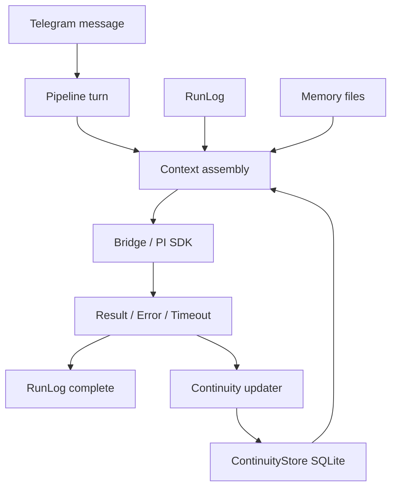

# Continuity Engine — Design

**Spec:** `.specs/features/continuity-engine/spec.md`  
**Status:** Implemented (MVP)

---

## Architecture Overview

Continuity Engine adds a small persistent state layer between volatile PI sessions and long-term memory files.



---

## Components

### 1. `internal/continuity`

Files:

| File | Responsibility |
|---|---|
| `types.go` | `ConversationState`, update structs, constants |
| `store.go` | Store interface |
| `store_sqlite.go` | SQLite implementation |
| `format.go` | Prompt-safe formatting and caps |
| `store_test.go` | Persistence, upsert, reload tests |

Interface:

```go
type Store interface {
    Get(ctx context.Context, chatID int64, threadID int) (*ConversationState, error)
    Upsert(ctx context.Context, state ConversationState) error
    Patch(ctx context.Context, key ConversationKey, patch StatePatch) error
}
```

`Patch` keeps call sites small and avoids every pipeline path rebuilding the whole state.

---

### 2. Pipeline integration

Locations:

- `internal/pipeline/pipeline.go`
- `internal/pipeline/prompt_builder.go`
- `cmd/aurelia/app.go`

Responsibilities:

1. Start service with optional `continuity.Store`.
2. On successful result, patch:
   - `cwd`
   - `last_user_intent`
   - `last_assistant_summary`
   - `last_run_status=completed`
   - `session_id`
   - `session_cold=false`
3. On timeout/error/empty result, patch:
   - `last_checkpoint`
   - `last_run_status`
   - `last_tools`
   - `session_cold=true`
   - `reset_reason`
4. Before auto-reset, patch `session_cold=true` and reason.

---

### 3. Prompt integration

Add helper near prompt assembly:

```go
func (s *Service) buildContinuitySection(chatID int64, threadID int, userText string) string
```

Rules:

- no store → empty section;
- missing state → empty section;
- stale state older than retention → empty section unless continuation-like;
- redact and cap before returning;
- wrap in `<continuity_state_untrusted>`.

Injection point:

```text
runtime identity
persona
agent instructions
telegram/cwd instructions
conversation continuity   <-- new
memory instructions
project docs
```

---

### 4. Active recall MVP

In Phase 2, active recall only reuses:

- latest run checkpoint already available via runlog;
- continuity state;
- current task memory already loaded by memory priority.

No FTS in MVP.

---

## Data Caps

Initial caps:

| Field | Cap |
|---|---:|
| `active_goal` | 300 chars |
| `last_user_intent` | 500 chars |
| `last_assistant_summary` | 900 chars |
| `last_checkpoint` | 1,200 chars |
| `last_tools` | 700 chars |
| Full continuity prompt block | 2,000 chars |

All truncation must be rune-safe.

---

## Security

- Use the strongest shared redaction available before persistence and prompt injection.
- Continuity block is untrusted context, never instructions.
- Do not persist raw full transcripts.
- Do not persist tool outputs beyond capped summaries.
- Store DB file and WAL/SHM should be `0600`, matching runlog.

---

## File Map

| File | Action | Responsibility |
|---|---|---|
| `internal/continuity/types.go` | Create | State and patch types |
| `internal/continuity/store.go` | Create | Store interface |
| `internal/continuity/store_sqlite.go` | Create | SQLite persistence |
| `internal/continuity/format.go` | Create | Redacted/capped prompt formatting |
| `internal/continuity/*_test.go` | Create | Store and formatting tests |
| `cmd/aurelia/app.go` | Modify | Initialize store and inject into pipeline |
| `internal/pipeline/service.go` or constructor file | Modify | Add continuity dependency |
| `internal/pipeline/pipeline.go` | Modify | Patch state on result/error/reset |
| `internal/pipeline/prompt_builder.go` | Modify | Inject continuity section |
| `internal/telegram/commands.go` | Modify later | Surface continuity in `/status` |

---

## Validation Gates

```bash
go test ./internal/continuity/... -v
go test ./internal/pipeline/... -run 'Test.*Continuity|Test.*Reset|Test.*Checkpoint' -v
go test ./internal/telegram/... -run 'Test.*Status' -v
go test ./... -short
go vet ./...
go build ./...
```
