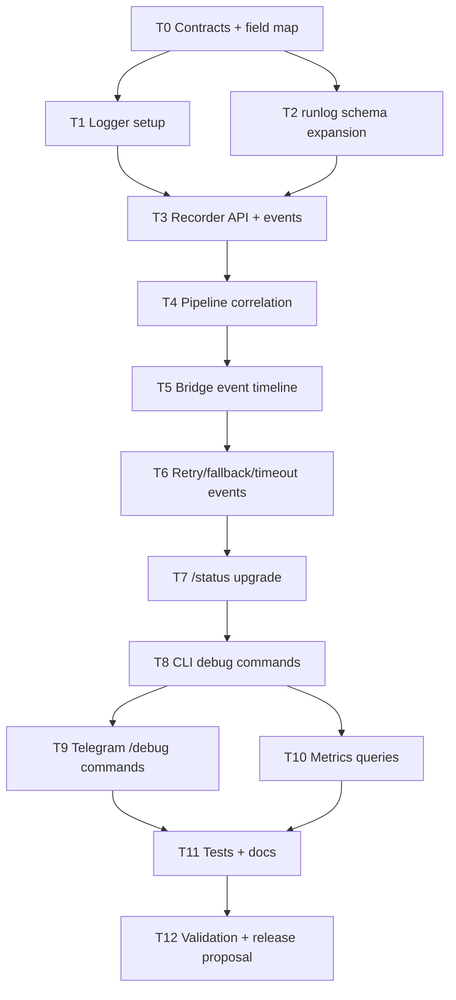

# Operational Observability — Tasks

**Design:** `.specs/features/operational-observability/design.md`  
**Roadmap step:** 2 — Observability Foundation  
**Status:** 🔴 A implementar  
**Depende de:** User Isolation + Security Guard-Rails + Project Binding  
**Desbloqueia:** safer Orchestration Cycle, Plan Mode debugging, operational support

---

## Execution Plan

---

## Task Breakdown

### T0: Contracts and field map

**What:** Document the field names and correlation contract before code changes.
**Where:** `internal/observability/`, `internal/runlog/`, `.specs/features/operational-observability/`
**Depends on:** None

**Done when:**

- [ ] `RunContext` fields are defined.
- [ ] Standard field names are documented in code comments.
- [ ] Entrypoints are enumerated: `telegram`, `cron`, `orchestration`, `nudge`, `cli`.
- [ ] Phase names are declared as constants.
- [ ] Redaction/truncation expectations are documented.

**Verify:** package builds with types only.

---

### T1: `internal/observability/logger.go` — structured logger setup

**What:** Add logger initialization from `AppConfig.LogLevel` and `AppConfig.LogFormat`.
**Where:** `internal/observability/logger.go`, `cmd/aurelia/app.go`
**Depends on:** T0

**Done when:**

- [ ] Supports `text` and `json` formats.
- [ ] Supports `debug`, `info`, `warn`, `error` levels.
- [ ] `slog.SetDefault` is called once during app bootstrap after config load.
- [ ] Invalid format/level falls back safely with a warning.
- [ ] Tests cover JSON output and level filtering.

**Verify:** `go test ./internal/observability/... -run TestLogger -v`

---

### T2: Expand `runlog` schema

**What:** Add run metadata fields and `run_events` table.
**Where:** `internal/runlog/store_sqlite.go`, `internal/runlog/types.go`
**Depends on:** T0

**Done when:**

- [ ] Idempotent migrations add `user_id`, `entrypoint`, `agent_name`, `provider`, `model`, `capability_profile`.
- [ ] Idempotent migrations add `duration_ms`, `input_tokens`, `output_tokens`, `cost_usd`, `tool_count`.
- [ ] Idempotent migrations add `error_class`, `timeout_origin`, `used_fallback`, `session_file`.
- [ ] `run_events` table exists with indexes.
- [ ] Existing DBs open without destructive migration.
- [ ] `Latest` remains backward-compatible.

**Verify:** `go test ./internal/runlog/... -v`

---

### T3: Recorder interface and event API

**What:** Add an event recorder abstraction and SQLite implementation.
**Where:** `internal/runlog/store.go`, `internal/runlog/store_sqlite.go`, optional `internal/observability/event.go`
**Depends on:** T2

**Done when:**

- [ ] `RecordEvent(ctx, RunEvent)` is available.
- [ ] `ListEvents(ctx, runID)` returns ordered events.
- [ ] Event metadata is JSON, redacted and byte-limited.
- [ ] Recorder calls use context timeouts in runtime code.
- [ ] Failures are logged but do not block the pipeline.

**Verify:** Store tests for event roundtrip, ordering, truncation and malformed metadata handling.

---

### T4: Pipeline run correlation

**What:** Create and propagate a `run_id` before Bridge execution.
**Where:** `internal/pipeline/service.go`, `internal/pipeline/pipeline.go`, `internal/runlog/`
**Depends on:** T3

**Done when:**

- [ ] `run_id` is created once per user turn before `bridge.Request` execution.
- [ ] `run_journal` start row includes `user_id`, `entrypoint`, `cwd`, `agent`, `provider`, `model`, `capability_profile`.
- [ ] `run_id` is stored in pipeline in-memory state by session key, not only chat/thread.
- [ ] Completion updates duration, tokens, cost and terminal status.
- [ ] `/status` can still read old rows.

**Verify:** Pipeline tests assert new run fields are populated for fake turns.

---

### T5: Bridge event timeline capture

**What:** Persist important Bridge NDJSON events as `run_events`.
**Where:** `internal/pipeline/pipeline.go`, `internal/bridge/events.go`
**Depends on:** T4

**Done when:**

- [ ] `bridge_request_started` event persisted before execution.
- [ ] `bridge_system` records model, session_file and tool list.
- [ ] `bridge_tool_use` records tool name and redacted argument summary.
- [ ] `bridge_tool_result` records redacted/truncated result summary.
- [ ] `bridge_result` records duration, tokens, turns and cost.
- [ ] `bridge_error` records redacted error message and error class.

**Verify:** Fake bridge event stream produces ordered run events.

---

### T6: Retry, fallback and timeout events

**What:** Make resilience visible in the timeline.
**Where:** `internal/pipeline/resilient_bridge.go`, `internal/pipeline/pipeline.go`, `internal/pipeline/circuit_breaker.go`
**Depends on:** T5

**Done when:**

- [ ] Retry attempts emit `retry_started` and `retry_failed` with attempt number.
- [ ] Fallback emits `fallback_started` and `fallback_result`.
- [ ] Circuit breaker open/half-open/closed transitions are observable.
- [ ] Timeout completion includes `timeout_origin` (`idle_bridge_timeout`, `max_execution_timeout`, etc.).
- [ ] Provider error category is persisted as `error_class`.

**Verify:** Resilient bridge tests assert fallback/retry timeline events.

---

### T7: `/status` observability upgrade

**What:** Add concise observability details to current status.
**Where:** `internal/telegram/commands.go`
**Depends on:** T4, T5

**Done when:**

- [ ] Latest run line includes short `run_id`.
- [ ] Shows provider/model when available.
- [ ] Shows duration, tokens/cost when available.
- [ ] Shows timeout/error class when terminal failed.
- [ ] Output remains concise and redacted.

**Verify:** Command tests for old rows and new rows.

---

### T8: CLI debug commands

**What:** Add local CLI for inspecting runs without SQLite spelunking.
**Where:** `cmd/aurelia/debug_cli.go`, `cmd/aurelia/main.go`
**Depends on:** T3, T4

**Done when:**

- [ ] `aurelia debug last` prints latest run.
- [ ] `aurelia debug run <id>` prints metadata + timeline.
- [ ] `aurelia debug errors --limit N` prints recent failed/timed-out runs.
- [ ] `--json` outputs machine-readable data.
- [ ] Missing DB/empty results have clear messages.

**Verify:** CLI tests with temp `runlog.db`.

---

### T9: Telegram `/debug` commands

**What:** Add owner-only Telegram debug commands.
**Where:** `internal/telegram/bot_middleware.go`, `internal/telegram/commands.go`
**Depends on:** T8 helpers or shared formatter

**Done when:**

- [ ] `/debug last` works and is owner-only.
- [ ] `/debug run <id>` shows compact timeline.
- [ ] `/debug errors` shows recent failed/timed-out runs.
- [ ] Non-owner receives permission denied.
- [ ] Output redacts prompt/checkpoint/tool data.

**Verify:** Telegram command tests for owner/non-owner and formatting.

---

### T10: Metrics queries

**What:** Add aggregate local metrics over a time window.
**Where:** `internal/runlog/metrics.go`, `cmd/aurelia/debug_cli.go`, Telegram debug formatter
**Depends on:** T2

**Done when:**

- [ ] Computes total runs, completed, failed, timed out, canceled.
- [ ] Computes success rate.
- [ ] Computes p50/p95 duration.
- [ ] Computes input/output tokens and cost.
- [ ] Breaks down by provider/model and entrypoint.
- [ ] Includes cron success/failure rate where available.

**Verify:** Metrics tests with seeded rows.

---

### T11: Docs and operator guide

**What:** Document how to use the observability layer.
**Where:** `docs/OBSERVABILITY.md`, `.specs/codebase/ARCHITECTURE.md`, `.specs/project/ROADMAP.md`
**Depends on:** T8, T9, T10

**Done when:**

- [ ] Operator guide explains `/debug` and CLI commands.
- [ ] Documents where logs live: launchd/stderr, `runlog.db`, `audit.log`.
- [ ] Documents env/config flags for log format/level.
- [ ] Documents privacy/redaction guarantees.
- [ ] Roadmap updated after implementation state is known.

**Verify:** Docs review.

---

### T12: Validation and release proposal

**What:** Full validation and release prep.
**Where:** repo root
**Depends on:** T11

**Done when:**

- [ ] `go build ./...` passes.
- [ ] `go vet ./...` passes.
- [ ] `go test ./... -v` passes.
- [ ] Manual smoke: send Telegram message, run `/debug last`, inspect same run with CLI.
- [ ] Manual smoke: force a Bridge error and confirm timeline shows failure phase.
- [ ] Propose version bump and changelog entry to Igor before release commit.

**Verify:** standard validation commands + manual checklist.

---

## Implementation Notes

- Prefer adding the schema and recorder first; it will make later orchestration work easier to debug.
- Do not store raw full prompts or raw tool outputs. Reuse existing redaction/truncation helpers.
- Keep event metadata small; large payloads belong in artifacts only if explicitly designed later.
- For this MVP, metrics can be computed on demand with SQL. No background metrics worker needed.
- `run_id` should become visible enough for the operator to copy/paste, but not noisy for normal users.
