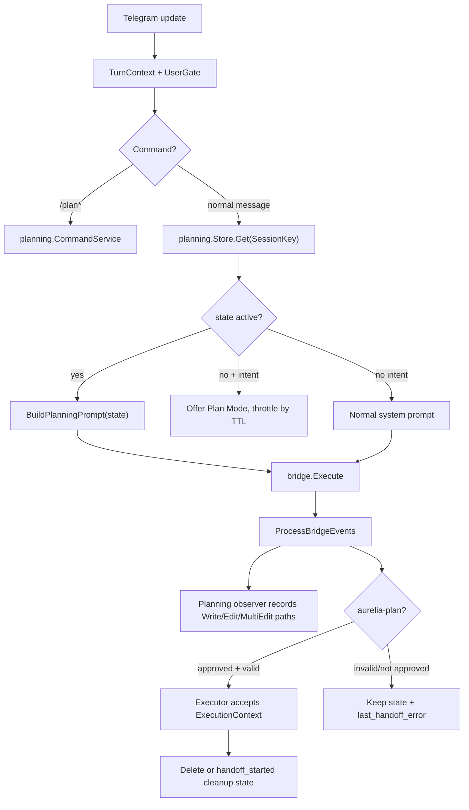

# Plan Mode Architecture — Design

**Spec:** `.specs/features/plan-mode-architecture/spec.md`
**Status:** Revised after code review

---

## Architecture Overview

Plan Mode é um estado persistente por usuário/conversa. Ele entra na pipeline depois do `UserGate` e antes da montagem do prompt.



Código atual que orienta esta revisão:

- `bridge/index.ts` já emite `tool_use` com `input: event.args`.
- `internal/bridge/events.go` já tem `Event.Input any`.
- `internal/pipeline/pipeline.go` só usa `ev.Name` para progresso e ignora `ev.Input`.
- `internal/pipeline/prompt_builder.go` injeta `BuildOrchestratorPrompt` diretamente quando `looksLikePlanningIntent` dispara.
- `tryExecutePlan` atual chama `ExecuteApprovedPlan(chatID, messageID, plan)`, mas a spec de orquestração revisada exige `ExecutionContext` com `threadID`, `cwd` e dono.

---

## Component Changes

### 1. New package `internal/planning/`

Plan Mode é estado de pipeline/Telegram, não submódulo do executor. Usar `internal/planning/` reduz acoplamento com `internal/orchestrator/`, mantendo o handoff como integração explícita.

**Files:**

- `internal/planning/store.go` — types e interface
- `internal/planning/store_sqlite.go` — SQLite implementation
- `internal/planning/discover.go` — `ProjectContext`
- `internal/planning/prompt.go` — `BuildPlanningPrompt`
- `internal/planning/observer.go` — captura de artefatos em eventos
- `internal/planning/offer.go` — throttle/TTL para ofertas implícitas
- `internal/planning/format.go` — mensagens de status/cancel/list

```go
type State struct {
    Key              session.SessionKey
    Version          int64
    Status           Status
    Phase            Phase
    FeatureSlug      string
    CWD              string
    ProjectCtx       *ProjectContext
    Materialized     []Artifact
    PendingSummary   string
    AwaitingApproval bool
    LastHandoffError string
    HandoffStartedAt *time.Time
    CreatedAt        time.Time
    UpdatedAt        time.Time
}

type Status string

const (
    StatusActive         Status = "active"
    StatusAwaitingExec   Status = "awaiting_exec"
    StatusHandoffStarted Status = "handoff_started"
)

type Phase string

const (
    PhaseSpecify      Phase = "specify"
    PhaseDesign       Phase = "design"
    PhaseTasks        Phase = "tasks"
    PhaseAwaitingExec Phase = "awaiting_exec"
)

type Artifact struct {
    Phase       Phase
    Path        string
    Tool        string
    InsideCWD   bool
    Confirmed   bool
    ObservedAt  time.Time
}

type Store interface {
    Get(ctx context.Context, key session.SessionKey) (*State, error)
    Save(ctx context.Context, state *State) error
    Delete(ctx context.Context, key session.SessionKey) error
    ListByUser(ctx context.Context, userID int64) ([]*State, error)
    GC(ctx context.Context, olderThan time.Duration) (int, error)
}
```

`Save` deve fazer optimistic locking com `version`. Em conflito, a pipeline recarrega e tenta merge simples de `Materialized`; para conflito em `Phase/Status`, preserva o estado mais recente e registra log.

### 2. SQLite storage

Não acoplar a store ao `internal/cron/store_sqlite.go`. A implementação pode reutilizar helpers de SQLite existentes, mas Plan Mode deve ter seu próprio store ou uma camada comum de DB app-wide.

```sql
CREATE TABLE IF NOT EXISTS planning_state (
    chat_id             INTEGER NOT NULL,
    thread_id           INTEGER NOT NULL,
    user_id             INTEGER NOT NULL,
    version             INTEGER NOT NULL DEFAULT 1,
    status              TEXT NOT NULL,
    phase               TEXT NOT NULL,
    feature_slug        TEXT,
    cwd                 TEXT NOT NULL,
    project_ctx         TEXT,
    materialized        TEXT NOT NULL DEFAULT '[]',
    pending_summary     TEXT,
    awaiting_approval   INTEGER NOT NULL DEFAULT 0,
    last_handoff_error  TEXT,
    handoff_started_at  INTEGER,
    created_at          INTEGER NOT NULL,
    updated_at          INTEGER NOT NULL,
    PRIMARY KEY (chat_id, thread_id, user_id)
);

CREATE INDEX IF NOT EXISTS idx_planning_state_user
ON planning_state(user_id);

CREATE INDEX IF NOT EXISTS idx_planning_state_updated
ON planning_state(updated_at);
```

Ofertas implícitas usam tabela separada para evitar transformar conversa normal em estado ativo:

```sql
CREATE TABLE IF NOT EXISTS planning_offer (
    chat_id     INTEGER NOT NULL,
    thread_id   INTEGER NOT NULL,
    user_id     INTEGER NOT NULL,
    intent_hash TEXT NOT NULL,
    offered_at  INTEGER NOT NULL,
    expires_at  INTEGER NOT NULL,
    PRIMARY KEY (chat_id, thread_id, user_id, intent_hash)
);
```

### 3. ProjectContext discovery

`Discover(cwd)` deve ser stat-only, determinístico e barato. Ele não lê conteúdo completo de `CLAUDE.md`/`AGENTS.md`; esses arquivos já entram por `buildProjectDocsSection`.

```go
type ProjectContext struct {
    Path              string
    IsRepo            bool
    HasClaudeMd       bool
    HasAgentsMd       bool
    HasReadme         bool
    Layouts           []PlanLayout
    NeedsLayoutChoice bool
    Stack             []string
    DetectedAt        time.Time
}

type PlanLayout struct {
    Kind string // "tlc" | "rfc" | "adr" | "planning"
    Path string
}
```

Rules:

- `.specs/features/` => `tlc`
- `docs/rfc/` ou `rfcs/` => `rfc`
- `docs/adr/` ou `adr/` => `adr`
- `planning/` => `planning`
- múltiplos layouts => `NeedsLayoutChoice=true`
- múltiplas stacks podem coexistir; registrar lista, não escolher uma arbitrária

### 4. BuildPlanningPrompt

`BuildPlanningPrompt(state)` substitui a injeção automática de `BuildOrchestratorPrompt` enquanto o state está ativo. Fora do Plan Mode, o prompt normal não deve receber orquestração por keyword.

Prompt deve incluir:

- identidade do modo e `phase/status`
- `cwd`
- resumo do `ProjectContext`
- artefatos com `confirmed/missing/outside_cwd`
- instrução para respeitar `CLAUDE.md`/`AGENTS.md`
- regra de não materializar drafts sem acordo do usuário
- regra de pedir escolha de layout se `NeedsLayoutChoice`
- regra de emitir `aurelia-plan` somente após aprovação explícita ou `/execute`
- formato de handoff alinhado com `agent-orchestration-execution`

O prompt não deve dizer que `/cancel` sai do modo; usar `/plan cancel` para não conflitar com cancelamento de execução ativa.

### 5. Tool-call observer

Observer roda dentro de `ProcessBridgeEvents` quando há state ativo.

```go
type Observer struct {
    state *State
    cwd   string
}

func (o *Observer) Handle(ev bridge.Event) (changed bool) {
    if ev.Type != "tool_use" {
        return false
    }
    if ev.Name != "Write" && ev.Name != "Edit" && ev.Name != "MultiEdit" {
        return false
    }
    paths := extractPaths(ev.Input)
    for _, p := range paths {
        artifact := o.normalizeArtifact(ev.Name, p)
        o.state.Materialized = appendOrUpdateArtifact(o.state.Materialized, artifact)
        changed = true
    }
    return changed
}
```

Path handling:

- `Write`/`Edit`: tentar `file_path`, `path`, `filename`
- `MultiEdit`: tentar `file_path` e paths por edição se existirem
- path relativo resolve contra `cwd`
- normalização usa `filepath.Clean` e `filepath.Abs`
- dentro/fora do cwd usa `filepath.Rel`; não usar `strings.HasPrefix`
- after `tool_result`, uma reconciliação best-effort faz `os.Stat` nos paths observados e marca `Confirmed`

`bridge.Event.Input` está tipado como `any`; o observer deve aceitar `map[string]any`, `map[string]interface{}` e fallback por marshal/unmarshal para `map[string]json.RawMessage`.

### 6. Pipeline integration

O pipeline precisa carregar `TurnContext`, não só `(chatID, threadID)`. A spec de User Isolation deve introduzir algo equivalente a:

```go
type TurnContext struct {
    ChatID  int64
    ThreadID int
    UserID  int64
    MessageID int
}
```

Integrações:

- `Process`/`processRun` recebem `TurnContext` ou `pipelineInput` com `userID`
- `buildSystemPrompt` recebe `planning.State`
- se state ativo e `ProjectCtx=nil`, discovery roda e salva
- se no state ativo o `cwd` atual diverge, avisar e re-descobrir
- se state ausente e heuristic dispara, responder oferta e encerrar turno sem chamar bridge
- `ProcessBridgeEvents` recebe state/observer opcional
- `handleResultEvent` chama handoff somente se state está `StatusAwaitingExec` ou `PhaseAwaitingExec`

O comportamento legado de `tryExecutePlan` fora do Plan Mode precisa ser decidido pela spec de orquestração. Para Plan Mode, a regra é fail-closed: sem aprovação explícita, não executa.

### 7. Command layer

Comandos:

- `/plan` — inicia ou mostra que já há state ativo
- `/plan status` — estado atual do usuário
- `/plan list` — lista states do `user_id`
- `/plan cancel` — remove state e preserva arquivos
- `/plan reset` — recria state após confirmação
- `/execute` — marca state como `awaiting_exec` e instrui próximo turno a emitir plano

Todos dependem de `TurnContext.UserID` e `UserGate`.

`/cancel` permanece para execução ativa/fila. Só deve cair para Plan Mode quando não houver execução ativa e a UX estiver documentada; o MVP usa `/plan cancel` para ser explícito.

### 8. Handoff with executor

Plan Mode não deve chamar executor direto com só `chatID/messageID`. O handoff monta o contrato revisado da orquestração:

```go
type PlanningHandoff struct {
    StateKey     session.SessionKey
    ExecutionCtx orchestrator.ExecutionContext
    Plan         *orchestrator.ExecutionPlan
    Artifacts    []planning.Artifact
}
```

Sequência segura:

1. usuário aprova (`/execute` ou frase clara em state ativo)
2. state vai para `awaiting_exec`
3. LLM emite `aurelia-plan`
4. parse e validação local passam
5. executor faz preflight e aceita
6. pipeline apaga state ou marca `handoff_started`

Se qualquer passo 3-5 falhar, o state permanece e `last_handoff_error` aparece em `/plan status`.

### 9. Boot cleanup

No startup:

- abrir planning store
- rodar migrations idempotentes
- `GC(30 * 24h)`
- logar count removido e erros sem bloquear boot

---

## Error Handling

| Cenário | Tratamento | UX |
|---|---|---|
| `/plan` sem `cwd` | Recusa | “Configure `/cwd <path>` antes de iniciar.” |
| usuário sem profile | `UserGate` bloqueia | mesma UX dos comandos protegidos |
| discovery falha | `ProjectContext` parcial + log | continua em modo conversa |
| múltiplos layouts | `NeedsLayoutChoice=true` | pede escolha antes de escrever |
| observer sem `input` parseável | log e ignora evento | silencioso |
| path fora do cwd | registra `inside_cwd=false` + log | aparece no status |
| stat pós-escrita falha | `confirmed=false` | status mostra pendente/missing |
| `aurelia-plan` sem aprovação | não executa | pede confirmação |
| parse/preflight falha | mantém state + erro | mostra em resposta/status |
| save conflita por version | recarrega/merge artefatos | silencioso salvo erro real |

---

## Tech Decisions

| Decisão | Escolha | Justificativa |
|---|---|---|
| Package | `internal/planning` | Plan Mode pertence à pipeline e comandos, não ao executor |
| Chave | `SessionKey` | Isolamento por usuário/tópico |
| `cwd` | conversation-scoped | Mantém semântica definida em User Isolation |
| Intent heuristic | oferta com TTL | Evita prompt injection silencioso |
| Store | SQLite própria/app DB | Não misturar com cron store |
| Materialized | `[]Artifact` | Suporta vários arquivos por fase e status de confirmação |
| Path inside cwd | `filepath.Rel` | Evita falso positivo por prefixo |
| Handoff cleanup | após aceite do executor | Evita perder plano em falha de parse/preflight |
| `/cancel` | não é comando primário de Plan Mode | Evita conflito com execução ativa |
| GC | 30 dias | Limpa abandono sem remover arquivos físicos |

---

## Testing Strategy

| Test | Where | Validates |
|---|---|---|
| `TestStore_Roundtrip` | `internal/planning/store_test.go` | Save/Get/Delete com `SessionKey` |
| `TestStore_OptimisticConflict` | same | versionamento evita overwrite silencioso |
| `TestStore_GC` | same | TTL remove rows antigas |
| `TestOfferStore_Throttle` | same | keyword não spamma oferta |
| `TestDiscover_Layouts` | `discover_test.go` | TLC/RFC/ADR/planning/múltiplos |
| `TestBuildPlanningPrompt_IncludesState` | `prompt_test.go` | Prompt contém contexto, artefatos, regras |
| `TestObserver_CapturesToolInputs` | `observer_test.go` | `Write`/`Edit`/`MultiEdit` |
| `TestObserver_UsesRelForCWD` | same | path prefix não engana inside-cwd |
| `TestPipeline_IntentOffersOnly` | `pipeline_test.go` | sem state, keyword oferece e não injeta orquestração |
| `TestPipeline_PlanStateInjectsPrompt` | same | state ativo injeta prompt |
| `TestPipeline_HandoffRequiresApproval` | same | `aurelia-plan` sem aprovação não executa |
| `TestPipeline_HandoffPreservesStateOnFailure` | same | parse/preflight falha preserva state |
| `TestCommands_UserIsolation` | `internal/telegram/...` | dois users no mesmo tópico não vazam state |
| `TestPlanCancel_DoesNotCancelActiveRun` | same | separa `/plan cancel` de `/cancel` |

---

## Rollout

1. **Prereqs:** User Isolation `TurnContext/UserGate` e Orchestration `ExecutionContext` aceitos nas specs.
2. **Foundation:** `internal/planning` types, store, migrations, offer throttle.
3. **Discovery + prompt:** `ProjectContext` e `BuildPlanningPrompt`.
4. **Pipeline:** state load, offer-only heuristic, prompt injection ativa.
5. **Observer:** event input parsing, artifact reconciliation.
6. **Commands:** `/plan`, `/plan status`, `/plan list`, `/plan cancel`, `/execute`.
7. **Handoff:** parse + `ExecutionContext` + cleanup após aceite.
8. **Validation:** E2E, build, vet, tests, version/changelog mediante aprovação.

Implementação parcial aceitável: iniciar por `/plan` explícito e deixar oferta implícita atrás de feature flag até o fluxo manual estar estável.
