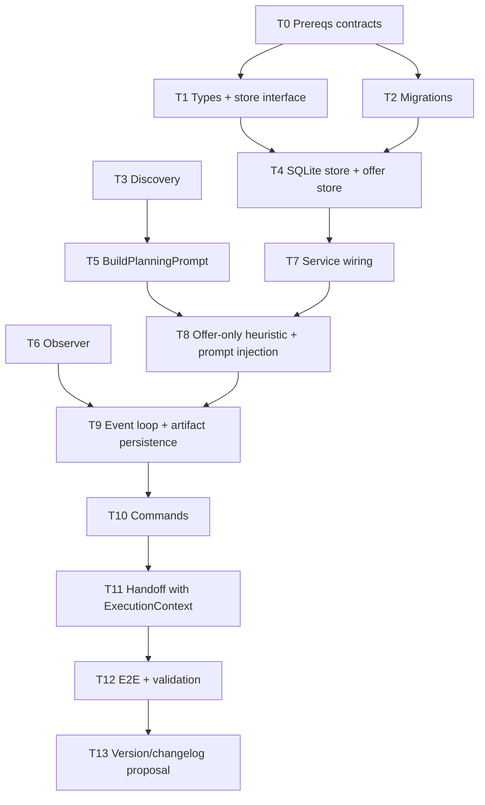

# Plan Mode Architecture — Tasks

**Design:** `.specs/features/plan-mode-architecture/design.md`
**Status:** Revised after code review

> Depende de User Isolation entregar `TurnContext`, `SessionKey` e `UserGate`.
> O handoff final depende da Orchestration spec entregar `ExecutionContext` e aceite/preflight do executor.

---

## Execution Plan

---

## Task Breakdown

### T0: Confirmar contratos de prereq

**What:** Travar os contratos mínimos vindos das specs dependentes antes de implementar.
**Where:** `.specs/features/multi-user-profiles/*`, `.specs/features/agent-orchestration-execution/*`
**Depends on:** None

**Done when:**

- [ ] `TurnContext`/`SessionKey` definido ou mapeado para o input real da pipeline
- [ ] `UserGate` definido como etapa antes de comandos protegidos
- [ ] `ExecutionContext` definido com `chatID`, `threadID`, `userID`, `cwd`
- [ ] contrato de “executor aceitou o plano” definido para cleanup do planning state
- [ ] decisão documentada sobre comportamento legado de `aurelia-plan` fora do Plan Mode

**Verify:** Review das specs dependentes; sem código ainda.

---

### T1: `internal/planning/store.go` — types + interfaces

**What:** Definir `State`, `Status`, `Phase`, `Artifact`, `ProjectContext`, `PlanLayout`, `Store`, `OfferStore`.
**Where:** `internal/planning/store.go`
**Depends on:** T0

**Done when:**

- [ ] `State` usa `session.SessionKey`
- [ ] `State` tem `Version`, `Status`, `Phase`, `Materialized []Artifact`, `LastHandoffError`
- [ ] `Artifact` registra `Path`, `Phase`, `Tool`, `InsideCWD`, `Confirmed`
- [ ] `Store` aceita `context.Context` em todos os métodos
- [ ] `OfferStore` suporta TTL/throttle por `SessionKey + intent_hash`
- [ ] Build de package isolado passa

**Verify:** `go test ./internal/planning/... -run TestTypes -v`

---

### T2: SQLite migrations para planning

**What:** DDL idempotente para `planning_state` e `planning_offer`, sem acoplar ao cron store.
**Where:** novo helper/app DB ou `internal/planning/store_sqlite.go`
**Depends on:** T0

**Done when:**

- [ ] `planning_state` criada com PK `(chat_id, thread_id, user_id)`
- [ ] `version`, `status`, `materialized`, `last_handoff_error`, `handoff_started_at` persistidos
- [ ] `planning_offer` criada com TTL
- [ ] indexes por `user_id` e `updated_at`
- [ ] migration roda em DB existente sem erro

**Verify:** Store tests criam DB temporário e inspecionam roundtrip.

---

### T3: `internal/planning/discover.go` — ProjectContext

**What:** Discovery stat-only para repo, docs, layouts e stacks.
**Where:** `internal/planning/discover.go`
**Depends on:** T1

**Done when:**

- [ ] Detecta `.git`, `CLAUDE.md`, `AGENTS.md`, `README`
- [ ] Detecta layouts TLC/RFC/ADR/planning e preserva múltiplos
- [ ] Marca `NeedsLayoutChoice` quando há mais de um layout
- [ ] Detecta stacks Go/Node/Python/Rust como lista
- [ ] Não lê conteúdo completo dos arquivos
- [ ] Tests cobrem TLC, RFC, ADR, múltiplos layouts, dir vazio

**Verify:** `go test ./internal/planning/... -run TestDiscover -v`

---

### T4: `internal/planning/store_sqlite.go` — implementação

**What:** Implementar `Store` e `OfferStore` em SQLite.
**Where:** `internal/planning/store_sqlite.go`
**Depends on:** T1, T2

**Done when:**

- [ ] `Get` retorna `nil, nil` quando não existe
- [ ] `Save` usa optimistic locking por `Version`
- [ ] `Delete` é idempotente
- [ ] `ListByUser` filtra só pelo `user_id`
- [ ] `GC` remove states antigos e ofertas expiradas
- [ ] `OfferStore` evita repetir oferta dentro do TTL
- [ ] Tests: roundtrip, conflito, delete inexistente, list, GC, offer throttle

**Verify:** `go test ./internal/planning/... -run 'TestStore|TestOffer' -v`

---

### T5: `internal/planning/prompt.go` — BuildPlanningPrompt

**What:** Construir prompt de Plan Mode a partir do state.
**Where:** `internal/planning/prompt.go`
**Depends on:** T1, T3

**Done when:**

- [ ] Prompt inclui status/fase, cwd, project context, layouts e artefatos
- [ ] Prompt respeita `NeedsLayoutChoice`
- [ ] Prompt orienta materialização opcional via Write/Edit/MultiEdit
- [ ] Prompt instrui handoff só após aprovação explícita
- [ ] Prompt não usa `/cancel` como saída primária do Plan Mode
- [ ] Tests cobrem state com/sem ProjectContext e com artefatos missing/outside

**Verify:** `go test ./internal/planning/... -run TestBuildPlanningPrompt -v`

---

### T6: `internal/planning/observer.go` — tool input observer

**What:** Observar `bridge.Event` e extrair artefatos escritos/editados.
**Where:** `internal/planning/observer.go`
**Depends on:** T1

**Done when:**

- [ ] Reconhece `tool_use` de `Write`, `Edit`, `MultiEdit`
- [ ] Extrai paths de `Event.Input` tipado como `any`
- [ ] Resolve path relativo contra `cwd`
- [ ] Usa `filepath.Rel` para classificar `InsideCWD`
- [ ] Registra múltiplos artefatos por fase
- [ ] Reconciliador pós-`tool_result`/fim de turno marca `Confirmed`
- [ ] Tests cobrem input parseável, input ausente, path relativo, path fora, falso prefixo

**Verify:** `go test ./internal/planning/... -run TestObserver -v`

---

### T7: Wire planning store no app e pipeline

**What:** Criar store no boot, injetar em `pipeline.Service` e carregar state por `TurnContext`.
**Where:** `cmd/aurelia/app.go`, `internal/pipeline/service.go`, `internal/pipeline/pipeline.go`
**Depends on:** T4, User Isolation code

**Done when:**

- [ ] App cria planning store e roda migrations
- [ ] Boot chama `GC(30d)` sem bloquear startup
- [ ] `pipelineInput` ou equivalente inclui `UserID`
- [ ] `processRun` carrega state por `SessionKey`
- [ ] state ativo reexecuta discovery se `ProjectCtx=nil` ou `cwd` mudou
- [ ] tests atualizados para incluir `userID`

**Verify:** `go build ./...`

---

### T8: Offer-only heuristic + prompt injection ativa

**What:** Substituir injeção silenciosa de `BuildOrchestratorPrompt` por oferta; injetar `BuildPlanningPrompt` só com state ativo.
**Where:** `internal/pipeline/planning_intent.go`, `internal/pipeline/prompt_builder.go`, pipeline tests
**Depends on:** T5, T7

**Done when:**

- [ ] `looksLikePlanningIntent` remove termos puramente de aprovação/execução do gatilho inicial
- [ ] Sem state + intent => responde oferta e não chama bridge
- [ ] Oferta tem throttle por TTL via `OfferStore`
- [ ] State ativo => `BuildPlanningPrompt(state)` no system prompt
- [ ] Sem state + sem intent => comportamento normal
- [ ] Tests: `TestPipeline_IntentOffersOnly`, `TestPipeline_OfferThrottle`, `TestPipeline_PlanStateInjectsPrompt`

**Verify:** `go test ./internal/pipeline/... -run 'TestPipeline_.*Plan|TestPipeline_.*Offer' -v`

---

### T9: Observer no event loop + persistência de artefatos

**What:** Passar eventos pelo observer e persistir state quando materialização mudar.
**Where:** `internal/pipeline/pipeline.go`
**Depends on:** T6, T7

**Done when:**

- [ ] `ProcessBridgeEvents` aceita state/observer opcional ou closure equivalente
- [ ] `tool_use` continua reportando progresso
- [ ] observer atualiza `Materialized`
- [ ] save ocorre após mudança e no final do turno após reconciliação
- [ ] falha de save loga e não derruba resposta do usuário
- [ ] Tests simulam bridge events com `input`

**Verify:** `go test ./internal/pipeline/... -run TestPipeline_PlanModeObservesAndSaves -v`

---

### T10: Comandos `/plan*`

**What:** Implementar comandos explícitos do Plan Mode.
**Where:** `internal/telegram/commands.go`, command registry/middleware
**Depends on:** T7, T8

**Done when:**

- [ ] `/plan` exige `cwd`, cria state ou informa state existente
- [ ] `/plan status` mostra fase, cwd, layouts, artefatos, idade, erro de handoff
- [ ] `/plan list` lista só states do usuário
- [ ] `/plan cancel` deleta state e lista artefatos preservados
- [ ] `/plan reset` pede confirmação antes de recriar
- [ ] `/execute` marca state como `awaiting_exec`
- [ ] todos passam por `UserGate`
- [ ] tests cobrem isolamento por usuário no mesmo tópico

**Verify:** `go test ./internal/telegram/... -run 'TestPlan|TestExecute' -v`

---

### T11: Handoff com `ExecutionContext`

**What:** Integrar Plan Mode com executor revisado.
**Where:** `internal/pipeline/pipeline.go`, `internal/orchestrator/*`, output interface
**Depends on:** T9, T10, Orchestration code

**Done when:**

- [ ] `aurelia-plan` em Plan Mode só executa com state `awaiting_exec`
- [ ] parse inválido preserva state e grava `LastHandoffError`
- [ ] handoff monta `ExecutionContext` com `chatID`, `threadID`, `userID`, `cwd`
- [ ] cleanup só ocorre após executor/preflight aceitar plano
- [ ] recusa do executor preserva state e informa usuário
- [ ] tests cobrem aceito, parse inválido, preflight recusado e plano sem aprovação

**Verify:** `go test ./internal/pipeline/... ./internal/orchestrator/... -run 'Test.*Handoff|Test.*ExecutionContext' -v`

---

### T12: E2E de fluxo completo

**What:** Test integrado do modo manual completo.
**Where:** `internal/pipeline/pipeline_e2e_test.go` ou suite equivalente
**Depends on:** T10, T11

**Done when:**

- [ ] `/plan` cria state
- [ ] mensagem normal injeta prompt de planning
- [ ] fake bridge emite `Write` e artifact fica registrado
- [ ] `/execute` muda state para awaiting exec
- [ ] fake bridge emite `aurelia-plan`
- [ ] executor mock aceita e state é limpo
- [ ] variação com executor recusando preserva state

**Verify:** `go test ./internal/pipeline/... -run TestE2E_PlanMode -v`

---

### T13: Validação, versão e changelog

**What:** Validar repo e preparar release metadata.
**Where:** projeto inteiro
**Depends on:** T12

**Done when:**

- [ ] `go build ./...` limpo
- [ ] `go vet ./...` limpo
- [ ] `go test ./... -v` limpo
- [ ] smoke manual em repo com `.specs/features/`
- [ ] smoke manual em dir sem layout
- [ ] proposta de bump + entrada `CHANGELOG.md` enviada ao Igor
- [ ] versão/changelog só alterados após aprovação explícita

**Verify:** comandos acima.

---

## Parallel Execution Map

- Paralelo inicial: T1, T2, T3 depois de T0.
- Paralelo médio: T5 e T6 depois de T1/T3; T4 depois de T1/T2.
- Sequencial crítico: T7 → T8 → T9 → T10 → T11.
- Validação: T12/T13 no final.

## Risks To Watch

- `TurnContext` ainda não existe no código atual; implementar Plan Mode antes de User Isolation exige adaptação temporária arriscada.
- `ExecuteApprovedPlan` atual não recebe `threadID/cwd/userID`; handoff seguro precisa esperar a revisão de Orchestration.
- Heuristic de intent atual é amplo demais; manter esse comportamento causaria regressão de UX.
- `Event.Input any` exige parsing defensivo; testes devem simular formatos reais do bridge.
- `/cancel` já tem semântica operacional; Plan Mode deve preferir `/plan cancel`.
