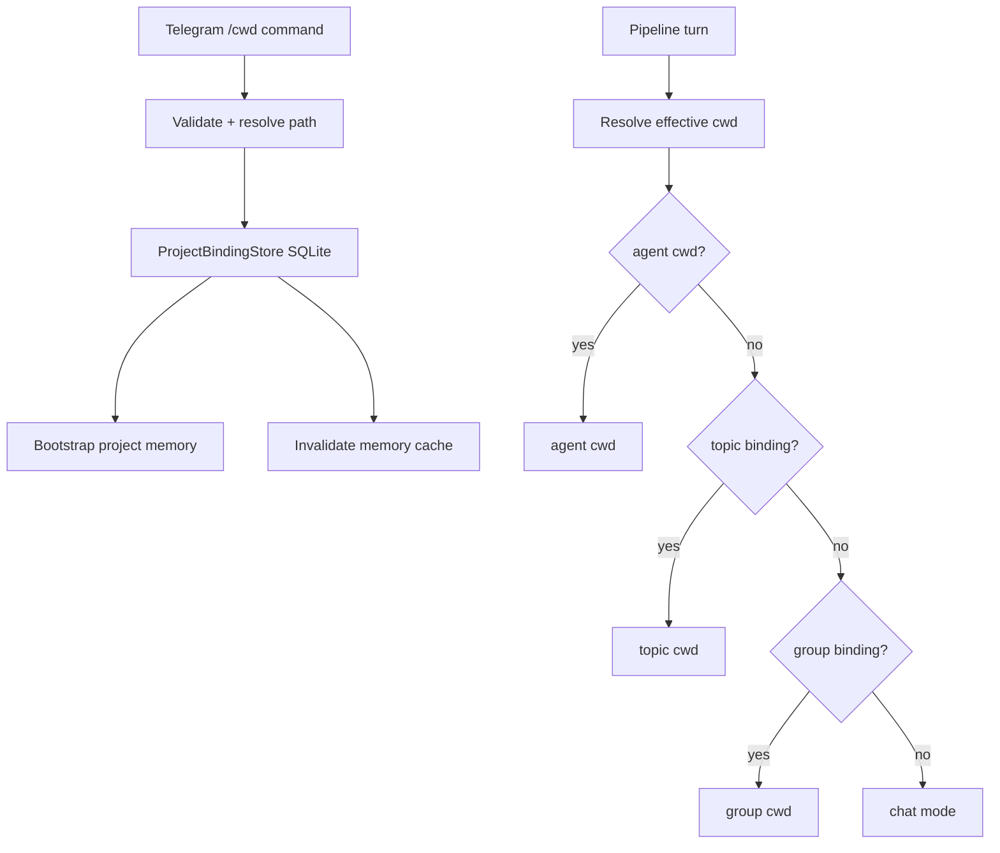

# Persistent Project Binding — Design

**Spec:** `.specs/features/project-binding/spec.md`  
**Status:** Draft

---

## Architecture Overview

Move `/cwd` from volatile session state to a persistent conversation-level project binding.



---

## Component Changes

### 1. Separate `ConversationKey`

**Location:** `internal/session/store.go` or new package `internal/conversation/`

Current `SessionKey` is `chat_id + thread_id`. User Isolation will extend session key with `user_id`; project binding must not follow that. Introduce explicit conversation key:

```go
type ConversationKey struct {
    ChatID   int64
    ThreadID int
}
```

Use it for `/cwd`, topic memory and project binding.

### 2. New store interface

**Location:** `internal/projectbinding/store.go`

```go
type Store interface {
    Get(ctx context.Context, key ConversationKey) (*ProjectBinding, error)
    Resolve(ctx context.Context, key ConversationKey) (*ResolvedBinding, error)
    Set(ctx context.Context, binding ProjectBinding) error
    Delete(ctx context.Context, key ConversationKey) error
    Touch(ctx context.Context, key ConversationKey) error
}

type ResolvedBinding struct {
    Binding  *ProjectBinding
    Inherited bool
    SourceKey ConversationKey
}
```

`Resolve` implements topic → group fallback.

### 3. SQLite implementation

**Location:** `internal/projectbinding/store_sqlite.go`

Can reuse the same app SQLite location/pattern used by cron/planning when available. If no shared DB abstraction exists yet, implement a small dedicated SQLite store.

Required behavior:

- create table on startup;
- upsert on `/cwd <path>`;
- delete by key;
- no TTL/GC for bindings;
- touch `last_used_at` on pipeline use.

### 4. Session store cleanup

`session.Store` should stop owning long-lived cwd state.

Migration path:

1. Keep `GetCwd/SetCwd` methods temporarily as adapters to project binding store if needed.
2. Remove cwd deletion from `Clear`, `ClearAll` and `GC` once callers use binding store.
3. Ensure tests distinguish clearing session from clearing project binding.

### 5. Effective cwd resolution

**Locations:** `internal/pipeline/prompt_builder.go`, `internal/telegram/bot_middleware.go`, orchestration handoff.

New logic:

```go
func effectiveCwd(agent *agents.Agent, chatID int64, threadID int) string {
    if agent != nil && agent.Cwd != "" {
        return agent.Cwd
    }
    binding := projectBindings.Resolve(ConversationKey{chatID, threadID})
    if binding != nil {
        return binding.CWD
    }
    return ""
}
```

### 6. `/cwd` command UX

Cases:

- `/cwd` — show resolution chain and persistence status.
- `/cwd <path>` — validate, resolve absolute path, persist binding for current key.
- `/cwd clear` — remove current key.
- `/cwd clear --group` — remove `(chat_id,0)`.

Example response:

```text
✅ Projeto fixado para este tópico:
/Users/igor/dev/aurelia

Essa configuração é persistente e continuará após reiniciar a Aurelia.
```

### 7. Auto-detect handling

Current pipeline can call `SetCwd` after project detection. Change this behavior:

- detected cwd can be used as ephemeral suggestion for current turn only;
- do not persist it through binding store;
- optionally send/record a suggestion: “Detectei X. Use `/cwd X` para fixar.”

### 8. Memory bootstrap

On successful binding set:

1. compute `project_slug`;
2. call project/team memory bootstrap;
3. invalidate memory cache for conversation;
4. future User Isolation can bootstrap user project memory on first turn by that user.

---

## File Map

| File | Action | Responsibility |
|---|---|---|
| `internal/projectbinding/store.go` | Create | Types and interface |
| `internal/projectbinding/store_sqlite.go` | Create | SQLite persistence |
| `internal/projectbinding/store_test.go` | Create | Fallback/upsert/delete tests |
| `internal/session/store.go` | Modify | Remove cwd lifetime coupling or add adapter during transition |
| `internal/telegram/bot_middleware.go` | Modify | `/cwd` UX and persistence |
| `internal/pipeline/prompt_builder.go` | Modify | effective cwd resolution |
| `internal/pipeline/pipeline.go` | Modify | auto-detect no longer silently persists |
| `cmd/aurelia/app.go` | Modify | Initialize/wire binding store |

---

## Validation Gates

```bash
go test ./internal/projectbinding/... -v
go test ./internal/session/... ./internal/pipeline/... ./internal/telegram/... -run "Test.*Cwd|Test.*ProjectBinding" -v
go build ./...
go vet ./...
go test ./... -short
```
