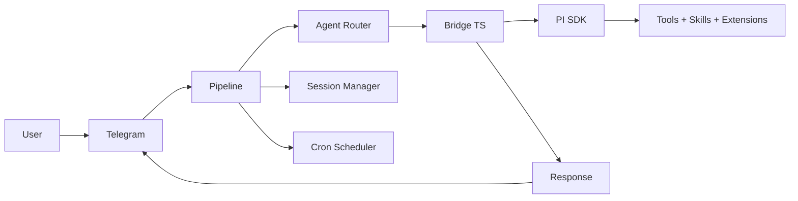

<div align="center">

# Aurelia OS


**An autonomous agent operating system in Go.**

Telegram-native. PI-powered. Built to stay light.

One persistent daemon, many projects, many agents.

[](https://go.dev/)
[](#runtime-model)
[](.specs/codebase/ARCHITECTURE.md)
[](https://sqlite.org/)
[](https://core.telegram.org/bots/api)
[](https://pi.dev)

</div>

## Why Aurelia OS

Aurelia is an autonomous agent operating system accessible via Telegram. Talk naturally — Aurelia decides whether to respond directly, delegate to a specialist agent, or schedule automated execution.

It is built around a practical execution model:

- Go daemon (24/7, lightweight, cross-platform)
- TypeScript Bridge wrapping the PI SDK
- PI coding agent as the brain (tools, skills, extensions, sessions)
- Canonical Go module and repository under `github.com/igormaneschy/aurelia`
- Session management with token tracking and auto-reset
- Persistent 3-layer memory system with automatic extraction
- Configurable agents in markdown with cron scheduling
- Multi-provider: Anthropic, Kimi, OpenRouter (live model catalog), Z.ai, Alibaba
- PI-first auth with API-key and subscription support
- Bridge recovery with automatic retry on crash

The goal is not to reimplement what PI already does.
The goal is to orchestrate it — adding persistence, memory, scheduling, multi-project support, and a natural Telegram interface on top.

## Core Capabilities

- **Natural conversation** via Telegram with text, photos, voice, and documents
- **Autonomous coding** — reads, writes, edits files, runs commands, searches code
- **Multi-project** — work on different projects simultaneously with isolated contexts
- **Persistent memory** — 3-layer memory system (global, project-private, project-team) that survives across sessions
- **Learning nudge** — automatic memory extraction from conversations on session reset
- **Dream consolidation** — periodic background review that organizes and deduplicates memories
- **Multi-provider** — Anthropic, Kimi, OpenRouter (with live model catalog), Z.ai, Alibaba
- **Session continuity** — conversation context persists across messages via session resume with auto-reset on token threshold
- **Smart routing** — LLM-based classification routes messages to the right agent
- **Persistent scheduling** — create cron jobs via natural conversation, results delivered to Telegram
- **Bridge recovery** — automatic retry with session resume when the Bridge process crashes
- **Tool progress** — see what PI is doing in real-time (reading files, running commands...)
- **Reply-to** — responses quote the original message for async conversation clarity
- **Photo analysis** — images downloaded and passed to PI for visual analysis
- **Voice transcription** — Groq STT converts voice messages to text (Whisper)
- **Vision fallback** — configure a separate vision model for image inputs
  while keeping a faster text-only model as default
- **Inherits your setup** — models, auth, skills, extensions, and settings from `~/.pi/agent`

## PI-backed Runtime Features

Aurelia now treats PI as the agent runtime rather than maintaining a Claude-specific bridge:

- **PI SDK bridge** — `bridge/index.ts` wraps `@earendil-works/pi-coding-agent` and is embedded into the Go binary.
- **PI auth reuse** — uses `~/.pi/agent/auth.json`, `models.json`, `settings.json`, skills, extensions, and provider configuration.
- **Subscription-friendly Anthropic auth** — resolves PI login first and keeps compatible Claude CLI auth as fallback.
- **Provider environment export** — Aurelia can export provider keys from `~/.aurelia/config/app.json` into the PI runtime environment.
- **Streaming progress** — PI tool events are mapped back into Telegram progress messages.
- **Long-lived sessions** — Bridge requests preserve session IDs for continuity and token tracking.

## Runtime Model

Aurelia separates three scopes:

1. **Repository** — product source code
2. **Local instance** — user runtime state (`~/.aurelia/`)
3. **Target projects** — external codebases the agent works on

High-level flow:



### Message Flow

```
1. Message arrives on Telegram
2. Pipeline extracts text/photo/voice/document
3. Agent router classifies → specialist agent or general
4. System prompt assembled: persona + agent + cron instructions
5. Request sent to Bridge (long-lived TypeScript process)
6. Bridge calls PI SDK → PI agent executes
7. Events streamed back: tool_use → progress, assistant → text, result → response
8. Response delivered to Telegram (reply-to original message)
9. Session token usage tracked, auto-reset if threshold exceeded
```

### Cron Flow

```
1. Scheduler polls every 15 seconds
2. Due job found → load agent config + persona
3. Execute via Bridge (Telegram plugin blocked to prevent wrong bot)
4. Result delivered to Telegram via TelegramDelivery
```

## Architecture

```text
cmd/aurelia/              CLI entry point, onboarding, cron CLI, telegram CLI
internal/bridge/          Go <> Bridge client (long-lived, multiplexed, bundle embedded via go:embed)
internal/telegram/        Telegram I/O, async pipeline, progress, reactions, commands
internal/session/         Session store, token tracking, nudge buffer
internal/agents/          Agent registry (markdown definitions, LLM classification)
internal/persona/         Persona loader (IDENTITY / SOUL / USER)
internal/dream/           Memory consolidation (dream) and extraction (nudge)
internal/cron/            Persistent cron scheduler with Telegram delivery
internal/config/          App configuration (providers, Telegram, sessions)
internal/runtime/         Path resolver + instance bootstrap + project memory dirs
internal/orchestrator/    Git operations, worktree management, PR creation
pkg/stt/                  Speech-to-text (Groq Whisper)
bridge/                   TypeScript Bridge source (compiled to bundle.js via esbuild, embedded in binary)
```

### Bridge Protocol

The Bridge is a **long-lived** TypeScript process that wraps `@earendil-works/pi-coding-agent`. Communication is via stdin/stdout NDJSON with request multiplexing:

**Go → Bridge (stdin):**
```json
{"command":"query","request_id":"req-1","prompt":"...","options":{"model":"k2.5","system_prompt":"...","cwd":"/path","permission_mode":"bypassPermissions"}}
```

With image attachments:
```json
{"command":"query","prompt":"Analise esta imagem","options":{"images":[{"data":"<base64>","media_type":"image/jpeg"}]}}
```

**Bridge → Go (stdout):**
```json
{"event":"system","request_id":"req-1","session_id":"abc-123","tools":["Read","Write"]}
{"event":"tool_use","request_id":"req-1","name":"Read","input":{"file_path":"src/main.go"}}
{"event":"assistant","request_id":"req-1","text":"The project has..."}
{"event":"result","request_id":"req-1","content":"...","cost_usd":0.12,"session_id":"abc-123"}
```

Multiple requests run concurrently — each with its own `request_id`.

### Agents

Configurable specialists defined in markdown (`~/.aurelia/agents/`):

```markdown
---
name: prospector
description: Busca leads e entra em contato
model: kimi-k2-thinking
schedule: "0 9 * * 1"
cwd: D:\projetos\crm
mcp_servers:
  google-places: { command: "npx google-places-mcp" }
allowed_tools: ["WebSearch", "WebFetch", "Bash"]
---

Voce eh um agente de prospeccao comercial.
Busque empresas no Google Places na regiao configurada.
```

Fields: `name`, `description`, `model`, `schedule`, `cwd`, `mcp_servers`, `allowed_tools`.

Agents with `schedule` are automatically registered in the cron scheduler.

### Persona

Three markdown files in `~/.aurelia/memory/personas/`:

- `IDENTITY.md` — name, role, rules, personality
- `SOUL.md` — tone, style, behavior
- `USER.md` — user information, preferences

Created automatically via `/start` on Telegram (choose "Coder" or "Assistant" preset).

## Memory System

Aurelia has a 3-layer persistent memory that survives across sessions:

| Layer | Location | Purpose |
|-------|----------|---------|
| **Global** | `~/.aurelia/memory/` | Personal facts, preferences, communication style |
| **Project Private** | `~/.aurelia/projects/<cwd>/memory/` | Personal notes, work log, task state |
| **Project Team** | `~/.aurelia/projects/<cwd>/memory/team/` | Stack, conventions, architecture (shareable) |

Memory is populated automatically:
- **Nudge** — extracts facts from conversations when a session resets (`/new` or auto-reset)
- **Dream** — periodic background consolidation that organizes, deduplicates, and prunes memory files

The model sees all memory layers in its system prompt and can read/write them during conversation.

## Telegram Commands

| Command | Description |
|---------|-------------|
| `/start` | Setup persona (first run) or welcome |
| `/help` | List available commands |
| `/new` | New session (flushes memory, clears context) |
| `/cwd <path>` | Set working directory for this chat |
| `/reset` | Reset session (alias for `/new`) |
| `/usage` | Show session token usage and cost |
| `/cron` | Manage schedules (list, add, delete, pause, resume) |
| `/agents` | List available agents |

## CLI

```bash
# Run the bot
go run ./cmd/aurelia/

# Interactive onboarding
go run ./cmd/aurelia/ onboard

# Cron management
aurelia cron add "30 8 * * *" "pesquise noticias de tech" --chat-id 123456
aurelia cron once "2026-03-22T09:00:00Z" "gere relatorio" --chat-id 123456
aurelia cron list
aurelia cron del <job-id>

# Telegram interaction (used by the agent via Bash)
aurelia telegram react <chat-id> <message-id> <emoji>
aurelia telegram send <chat-id> <text>
aurelia telegram reply <chat-id> <message-id> <text>
```

## Setup

Requirements:

- Go `1.25+`
- Node.js `18+`
- Telegram bot token
- One LLM provider:
  - **PI auth/config** in `~/.pi/agent` (`pi /login`, `auth.json`, `models.json`)
  - **Anthropic** — API key or Max subscription via PI
  - **Kimi** — API key (`KIMI_API_KEY` / PI auth)
  - **OpenRouter** — API key (multi-model proxy)
  - **Z.ai** — API key (GLM Coding Plan)
  - **Alibaba** — API key (Qwen Coding Plan)
- Groq API key for voice transcription (optional)

### Quick Start

1. Clone the canonical repository:
   ```bash
   git clone https://github.com/igormaneschy/aurelia.git
   cd aurelia
   ```

2. Configure PI auth/models if you have not already:
   ```bash
   pi /login
   ```

3. Run onboarding:
   ```bash
   go run ./cmd/aurelia/ onboard
   ```

4. Start:
   ```bash
   go run ./cmd/aurelia/
   ```

5. Send `/start` to your bot on Telegram.

### Hot Reload (Development)

```bash
go install github.com/air-verse/air@latest
air
```

### Config

Main config lives in `~/.aurelia/config/app.json`:

```json
{
  "default_provider": "opencode-go",
  "default_model": "deepseek-v4-flash",
  "providers": {
    "opencode": { "api_key": "sk-..." },
    "groq": { "api_key": "gsk-..." }
  },
  "telegram_bot_token": "your-token",
  "telegram_allowed_user_ids": [123456789],
  "stt_provider": "groq",
  "vision_model": "qwen3.5-plus",
  "vision_provider": "opencode-go",
  "max_iterations": 500,
  "max_session_tokens": 100000
}
```

Provider auth is resolved by PI first. For Anthropic subscription mode, run `pi /login` or keep a compatible Claude auth as fallback.

### Release Build

```bash
go build -trimpath -ldflags "-s -w" -o ./build/aurelia.exe ./cmd/aurelia
```

## Documentation

| Document | Purpose |
|----------|---------|
| [CLAUDE.md](CLAUDE.md) | Instructions for coding agents |
| [CHANGELOG.md](CHANGELOG.md) | Release history and changes |
| [.specs/codebase/ARCHITECTURE.md](.specs/codebase/ARCHITECTURE.md) | System architecture and patterns |
| [.specs/codebase/CONVENTIONS.md](.specs/codebase/CONVENTIONS.md) | Code conventions and Go patterns |
| [.specs/codebase/STACK.md](.specs/codebase/STACK.md) | Technology stack and dependencies |
| [.specs/project/PROJECT.md](.specs/project/PROJECT.md) | Vision, constraints, current state |
| [.specs/project/ROADMAP.md](.specs/project/ROADMAP.md) | Feature roadmap |

## Development

```bash
go build ./...        # Build
go test ./... -short  # Test
go vet ./...          # Lint
air                   # Hot reload
```

To rebuild the Bridge bundle after modifying `bridge/index.ts`:

```bash
cd bridge && npm run build
cp bundle.js ../internal/bridge/bundle.js
```

## Current State

- **v0.4.1 base + PI SDK migration branch** — see [CHANGELOG.md](CHANGELOG.md)
- Canonical repository: `https://github.com/igormaneschy/aurelia`
- Go module: `github.com/igormaneschy/aurelia`
- Go test suite is green
- TypeScript Bridge compiles clean
- Cross-platform: macOS, Windows, and Linux
- Active development on `migrate-pi-brain` before merge to `main`
