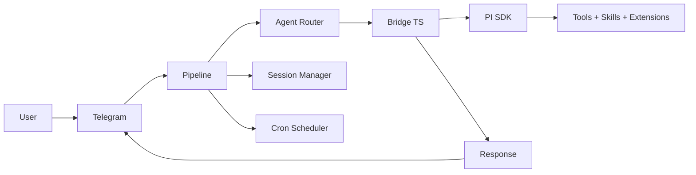

<div align="center">

# Aurelia OS


**An autonomous agent operating system in Go.**

Telegram-native. PI-powered. Built to stay light.

One persistent daemon, many projects, many agents.

[](https://go.dev/)
[](#runtime-model)
[](.specs/codebase/ARCHITECTURE.md)
[](https://sqlite.org/)
[](https://core.telegram.org/bots/api)
[](https://pi.dev)

</div>

## Prerequisites

Before installing, ensure you have:

- **Go** `1.25+` — [go.dev](https://go.dev/)
- **Node.js** `18+` and **npm** `8+` — [nodejs.org](https://nodejs.org/)
  - *The PI SDK (inference engine) installs automatically via npm on first run*
  - *No need to install the PI CLI (`pi`) or run `pi /login`*
- **git** `2+`
- **gh** (GitHub CLI) — optional but recommended
- A **Telegram bot token** from [@BotFather](https://t.me/botfather)
- An **LLM provider API key**:
  - **OpenRouter** — recommended (multi-model proxy, one key for many models)
  - **opencode-go** — alternative (OpenCode API key)

## Why Aurelia OS

Aurelia is an autonomous agent operating system accessible via Telegram. Talk naturally — Aurelia decides whether to respond directly, delegate to a specialist agent, or schedule automated execution.

It is built around a practical execution model:

- Go daemon (24/7, lightweight, cross-platform)
- TypeScript Bridge wrapping the PI SDK
- PI coding agent as the brain (tools, skills, extensions, sessions)
- Canonical Go module and repository under `github.com/igormaneschy/aurelia`
- Session management with token tracking and auto-reset
- Persistent 3-layer memory system with automatic extraction
- Configurable agents in markdown with cron scheduling
- Multi-provider: OpenRouter (recommended), opencode-go, Anthropic, Kimi, Z.ai, Alibaba
- API key authentication (OpenRouter, opencode-go)
- Bridge recovery with automatic retry on crash

The goal is not to reimplement what PI already does.
The goal is to orchestrate it — adding persistence, memory, scheduling, multi-project support, and a natural Telegram interface on top.

## Core Capabilities

- **Natural conversation** via Telegram with text, photos, voice, and documents
- **Autonomous coding** — reads, writes, edits files, runs commands, searches code
- **Multi-project** — work on different projects simultaneously with isolated contexts
- **Persistent memory** — 3-layer memory system (global, project-private, project-team) that survives across sessions
- **Learning nudge** — automatic memory extraction from conversations on session reset
- **Dream consolidation** — periodic background review that organizes and deduplicates memories
- **Multi-provider** — OpenRouter (recommended), opencode-go, Anthropic, Kimi, Z.ai, Alibaba
- **Session continuity** — conversation context persists across messages via session resume with auto-reset on token threshold
- **Smart routing** — LLM-based classification routes messages to the right agent
- **Persistent scheduling** — create cron jobs via natural conversation, results delivered to Telegram
- **Bridge recovery** — automatic retry with session resume when the Bridge process crashes
- **Tool progress** — see what PI is doing in real-time (reading files, running commands...)
- **Reply-to** — responses quote the original message for async conversation clarity
- **Photo analysis** — images downloaded and passed to PI for visual analysis
- **Voice transcription** — Groq STT converts voice messages to text (Whisper)
- **Vision fallback** — configure a separate vision model for image inputs
  while keeping a faster text-only model as default

## Runtime Features

Aurelia uses a TypeScript Bridge wrapping the PI SDK as its inference engine:

- **Bridge** — `bridge/index.ts` wraps `@earendil-works/pi-coding-agent` and is embedded into the Go binary.
- **API key auth** — provider keys are configured during onboarding and exported to the bridge runtime environment.
- **Streaming progress** — PI tool events are mapped back into Telegram progress messages.
- **Long-lived sessions** — Bridge requests preserve session IDs for continuity and token tracking.

## Runtime Model

Aurelia separates three scopes:

1. **Repository** — product source code
2. **Local instance** — user runtime state (`~/.aurelia/`)
3. **Target projects** — external codebases the agent works on

High-level flow:



### Message Flow

```
1. Message arrives on Telegram
2. Pipeline extracts text/photo/voice/document
3. Agent router classifies → specialist agent or general
4. System prompt assembled: persona + agent + cron instructions
5. Request sent to Bridge (long-lived TypeScript process)
6. Bridge calls PI SDK → PI agent executes
7. Events streamed back: tool_use → progress, assistant → text, result → response
8. Response delivered to Telegram (reply-to original message)
9. Session token usage tracked, auto-reset if threshold exceeded
```

### Cron Flow

```
1. Scheduler polls every 15 seconds
2. Due job found → load agent config + persona
3. Execute via Bridge (Telegram plugin blocked to prevent wrong bot)
4. Result delivered to Telegram via TelegramDelivery
```

## Architecture

```text
cmd/aurelia/              CLI entry point, onboarding, cron CLI, telegram CLI
internal/bridge/          Go <> Bridge client (long-lived, multiplexed, bundle embedded via go:embed)
internal/telegram/        Telegram I/O, async pipeline, progress, reactions, commands
internal/session/         Session store, token tracking, nudge buffer
internal/agents/          Agent registry (markdown definitions, LLM classification)
internal/persona/         Persona loader (IDENTITY / SOUL / USER)
internal/dream/           Memory consolidation (dream) and extraction (nudge)
internal/cron/            Persistent cron scheduler with Telegram delivery
internal/config/          App configuration (providers, Telegram, sessions)
internal/runtime/         Path resolver + instance bootstrap + project memory dirs
internal/orchestrator/    Git operations, worktree management, PR creation
pkg/stt/                  Speech-to-text (Groq Whisper)
bridge/                   TypeScript Bridge source (compiled to bundle.js via esbuild, embedded in binary)
```

### Bridge Protocol

The Bridge is a **long-lived** TypeScript process that wraps `@earendil-works/pi-coding-agent`. Communication is via stdin/stdout NDJSON with request multiplexing:

**Go → Bridge (stdin):**
```json
{"command":"query","request_id":"req-1","prompt":"...","options":{"model":"k2.5","system_prompt":"...","cwd":"/path","permission_mode":"bypassPermissions"}}
```

With image attachments:
```json
{"command":"query","prompt":"Analise esta imagem","options":{"images":[{"data":"<base64>","media_type":"image/jpeg"}]}}
```

**Bridge → Go (stdout):**
```json
{"event":"system","request_id":"req-1","session_id":"abc-123","tools":["Read","Write"]}
{"event":"tool_use","request_id":"req-1","name":"Read","input":{"file_path":"src/main.go"}}
{"event":"assistant","request_id":"req-1","text":"The project has..."}
{"event":"result","request_id":"req-1","content":"...","cost_usd":0.12,"session_id":"abc-123"}
```

Multiple requests run concurrently — each with its own `request_id`.

### Agents

Configurable specialists defined in markdown (`~/.aurelia/agents/`):

```markdown
---
name: prospector
description: Busca leads e entra em contato
model: kimi-k2-thinking
schedule: "0 9 * * 1"
cwd: D:\projetos\crm
mcp_servers:
  google-places: { command: "npx google-places-mcp" }
allowed_tools: ["WebSearch", "WebFetch", "Bash"]
---

Voce eh um agente de prospeccao comercial.
Busque empresas no Google Places na regiao configurada.
```

Fields: `name`, `description`, `model`, `schedule`, `cwd`, `mcp_servers`, `allowed_tools`.

Agents with `schedule` are automatically registered in the cron scheduler.

### Persona

Three markdown files in `~/.aurelia/memory/personas/`:

- `IDENTITY.md` — name, role, rules, personality
- `SOUL.md` — tone, style, behavior
- `USER.md` — user information, preferences

Created automatically via `/start` on Telegram (choose "Coder" or "Assistant" preset).

## Memory System

Aurelia has a 3-layer persistent memory that survives across sessions:

| Layer | Location | Purpose |
|-------|----------|---------|
| **Global** | `~/.aurelia/memory/` | Personal facts, preferences, communication style |
| **Project Private** | `~/.aurelia/projects/<cwd>/memory/` | Personal notes, work log, task state |
| **Project Team** | `~/.aurelia/projects/<cwd>/memory/team/` | Stack, conventions, architecture (shareable) |

Memory is populated automatically:
- **Nudge** — extracts facts from conversations when a session resets (`/new` or auto-reset)
- **Dream** — periodic background consolidation that organizes, deduplicates, and prunes memory files

The model sees all memory layers in its system prompt and can read/write them during conversation.

## Telegram Commands

| Command | Description |
|---------|-------------|
| `/start` | Setup persona (first run) or welcome |
| `/help` | List available commands |
| `/new` | New session (flushes memory, clears context) |
| `/cwd <path>` | Set working directory for this chat |
| `/reset` | Reset session (alias for `/new`) |
| `/usage` | Show session token usage and cost |
| `/cron` | Manage schedules (list, add, delete, pause, resume) |
| `/agents` | List available agents |

## CLI

```bash
# Run the bot
go run ./cmd/aurelia/

# Interactive onboarding
go run ./cmd/aurelia/ onboard

# Cron management
aurelia cron add "30 8 * * *" "pesquise noticias de tech" --chat-id 123456
aurelia cron once "2026-03-22T09:00:00Z" "gere relatorio" --chat-id 123456
aurelia cron list
aurelia cron del <job-id>

# Telegram interaction (used by the agent via Bash)
aurelia telegram react <chat-id> <message-id> <emoji>
aurelia telegram send <chat-id> <text>
aurelia telegram reply <chat-id> <message-id> <text>
```

## Setup

Requirements:

- Go `1.25+`
- Node.js `18+` and npm `8+` (the PI SDK installs automatically on first run)
- Telegram bot token
- One LLM provider:
  - **OpenRouter** — recommended (multi-model proxy, one key for many models)
  - **opencode-go** — alternative (OpenCode API key)
  - **Local models** — Ollama or any OpenAI-compatible local server (optional, see [Local Models](#local-models))
- Groq API key for voice transcription (optional)

### Quick Start

1. **Clone** the repository:
   ```bash
   git clone https://github.com/igormaneschy/aurelia.git
   cd aurelia
   ```

   > **Note**: You do not need to install the PI CLI (`pi`) or run `pi /login`. The PI SDK is bundled and installed automatically by Aurelia.

2. **Run the onboarding wizard** (required before first start):
   ```bash
   go run ./cmd/aurelia/ onboard
   ```
   This interactive wizard will guide you through:
   - Dependency verification
   - LLM provider selection (OpenRouter or opencode-go)
   - API key configuration
   - Telegram bot token validation
   - User access control

3. **Start the daemon**:
   ```bash
   go run ./cmd/aurelia/
   ```

4. **Send `/start`** to your bot on Telegram.

> **Note**: If you skip step 2 and run the daemon directly, it will exit with instructions to complete onboarding first.

### Hot Reload (Development)

```bash
go install github.com/air-verse/air@latest
air
```

### Config

Main config lives in `~/.aurelia/config/app.json`:

```json
{
  "default_provider": "opencode-go",
  "default_model": "deepseek-v4-flash",
  "providers": {
    "opencode": { "api_key": "sk-..." },
    "groq": { "api_key": "gsk-..." }
  },
  "telegram_bot_token": "your-token",
  "telegram_allowed_user_ids": [123456789],
  "stt_provider": "groq",
  "vision_model": "qwen3.5-plus",
  "vision_provider": "opencode-go",
  "max_iterations": 500,
  "max_session_tokens": 100000
}
```

Provider auth uses API keys configured during onboarding. OpenRouter is recommended as it provides access to multiple models with a single key.

### Release Build

```bash
go build -trimpath -ldflags "-s -w" -o ./build/aurelia.exe ./cmd/aurelia
```

## Local Models

Aurelia supports local models via [Ollama](https://ollama.com/) or any OpenAI-compatible inference server. This is ideal for offline work, privacy, or cost reduction.

### Setup

1. **Install Ollama** and pull a model:
   ```bash
   ollama pull llama3.1:8b
   ollama pull qwen2.5-coder:7b
   ```

2. **Configure Aurelia** by editing `~/.aurelia/pi-agent/models.json`:
   ```json
   {
     "providers": {
       "ollama": {
         "baseUrl": "http://localhost:11434/v1",
         "api": "openai-completions",
         "apiKey": "ollama",
         "compat": {
           "supportsDeveloperRole": false,
           "supportsReasoningEffort": false,
           "supportsToolChoice": false
         },
         "models": [
           {
             "id": "llama3.1:8b",
             "name": "Llama 3.1 8B (local)",
             "reasoning": false,
             "input": ["text"],
             "contextWindow": 128000,
             "maxTokens": 32000,
             "cost": { "input": 0, "output": 0, "cacheRead": 0, "cacheWrite": 0 }
           },
           {
             "id": "qwen2.5-coder:7b",
             "name": "Qwen2.5 Coder 7B (local)",
             "reasoning": false,
             "input": ["text"],
             "contextWindow": 32768,
             "maxTokens": 8192,
             "cost": { "input": 0, "output": 0, "cacheRead": 0, "cacheWrite": 0 }
           }
         ]
       }
     }
   }
   ```

3. **Update Aurelia config** (`~/.aurelia/config/app.json`):
   ```json
   {
     "default_provider": "ollama",
     "default_model": "llama3.1:8b"
   }
   ```

4. **Restart the daemon**:
   ```bash
   make restart
   ```

### Notes

- Ollama must be running (`ollama serve`) before starting Aurelia
- The `apiKey` field is required by the PI SDK but ignored by Ollama — any value works
- Local models do not support image input or advanced tool calling — use cloud providers for those features
- For other local servers (vLLM, LM Studio, etc.), adjust `baseUrl` and `api` accordingly

## Documentation

| Document | Purpose |
|----------|---------|
| [CLAUDE.md](CLAUDE.md) | Instructions for coding agents |
| [CHANGELOG.md](CHANGELOG.md) | Release history and changes |
| [.specs/codebase/ARCHITECTURE.md](.specs/codebase/ARCHITECTURE.md) | System architecture and patterns |
| [.specs/codebase/CONVENTIONS.md](.specs/codebase/CONVENTIONS.md) | Code conventions and Go patterns |
| [.specs/codebase/STACK.md](.specs/codebase/STACK.md) | Technology stack and dependencies |
| [.specs/project/PROJECT.md](.specs/project/PROJECT.md) | Vision, constraints, current state |
| [.specs/project/ROADMAP.md](.specs/project/ROADMAP.md) | Feature roadmap and implementation order |

## Development

```bash
go build ./...        # Build
go test ./... -short  # Test
go vet ./...          # Lint
air                   # Hot reload
```

To rebuild the Bridge bundle after modifying `bridge/index.ts`:

```bash
make bridge           # bundles + copies into internal/bridge/
```

## Running as a Service

### macOS (launchd)

```bash
make install-service  # one-time: install launchd plist (auto-restart, RunAtLoad)
make deploy           # build atomically + kick the daemon
make logs             # tail daemon stderr
make status           # show launchd state
```

### Linux (systemd)

```bash
make install-service-linux  # one-time: install user systemd service
make deploy                 # build atomically + restart service
journalctl --user -u aurelia -f  # tail logs
```

Full guide: [docs/OPERATIONS.md](docs/OPERATIONS.md).

## Troubleshooting

| Problem | Solution |
|---------|----------|
| Daemon exits immediately | Run `go run ./cmd/aurelia/ onboard` first |
| "Token is invalid" during onboard | Verify token with @BotFather, ensure bot is not already running elsewhere |
| Bridge fails to build | Check `node --version` ≥ 18 and `npm --version` ≥ 8 |
| "Dependency missing" error | Install the missing tool and re-run onboarding |

## Current State

- **v0.4.1 base + PI SDK migration branch** — see [CHANGELOG.md](CHANGELOG.md)
- Canonical repository: `https://github.com/igormaneschy/aurelia`
- Go module: `github.com/igormaneschy/aurelia`
- Go test suite is green
- TypeScript Bridge compiles clean
- Cross-platform: macOS, Windows, and Linux
- Active development on `migrate-pi-brain` before merge to `main`
